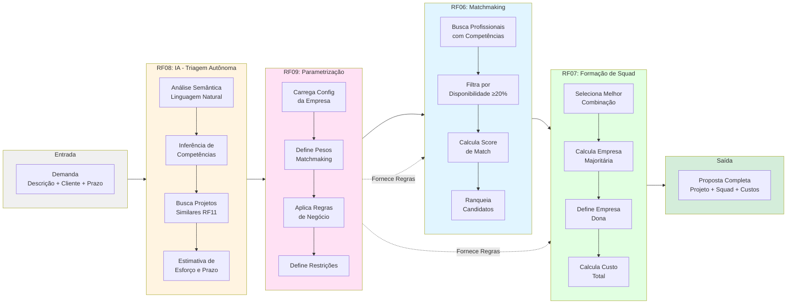
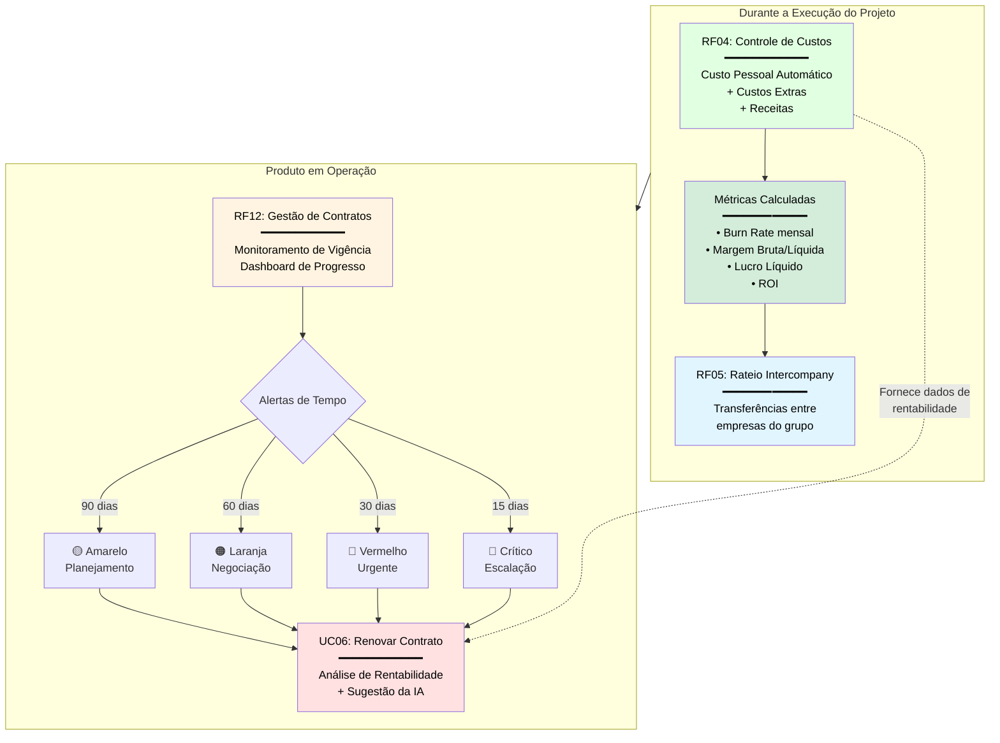
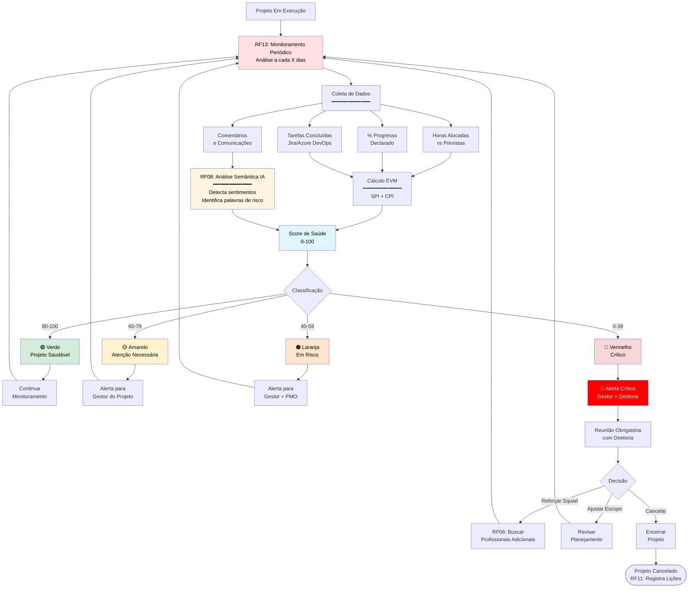

# Sistema de Gestão de Portfólio Integrado (SGPI)
## Documento de Requisitos - Versão 2.5

---

## 1. Visão Geral do Sistema

### 1.1 Propósito
O SGPI é uma plataforma corporativa para gestão integrada do ciclo de vida de iniciativas (Projetos e Produtos) em um grupo econômico multitempresa. O sistema centraliza:

- **Gestão de Demandas**: Desde a entrada até a aprovação
- **Alocação Inteligente**: Matchmaking de talentos com necessidades de projetos
- **Controle Financeiro**: Custos, receitas e rateios intercompany
- **Governança**: Ownership, auditoria e transferência de ativos

### 1.2 Escopo
O sistema abrange todas as empresas do grupo econômico, permitindo que profissionais de diferentes unidades de negócio sejam alocados em projetos transversais, com controle de custos e rateios entre empresas.

---

## 1.3 Diagrama de Processos Principais

### Fluxo Macro do Sistema

```mermaid
flowchart TB
    Start([Necessidade é identificada<br/>por qualquer pessoa]) --> RF01_Demanda[RF01: Cadastrar Demanda<br/>através de Formulário]
    
    RF01_Demanda --> Pipeline[Pipeline Automático<br/>de Análise]
    
    Pipeline --> RF08[RF08: Triagem por IA:<br/>Infere competências<br/>Estima esforço/prazo<br/>Busca projetos similares]
    
    RF08 --> RF09[RF09: Parametrização:<br/>Aplica regras da empresa<br/>Define pesos e restrições]
    
    RF09 --> RF06[RF06: Matchmaking:<br/>Busca profissionais disponíveis<br/>Calcula score de match<br/>Ranqueia candidatos]
    
    RF06 --> RF07[RF07: Formação de Squad:<br/>Monta equipe ideal<br/>Define empresa dona<br/>Calcula custo total]
    
    RF07 --> Proposta[Proposta de Projeto<br/>Completa Gerada]
    
    Proposta --> UC07[UC07: Aprovação<br/>Comitiva Autorizada]
    
    UC07 --> Decisao{Decisão da<br/>Comitiva}
    
    Decisao -->|Recusar| Rejeitado([Projeto Rejeitado<br/>RF11: Registra aprendizado])
    Decisao -->|Solicitar Ajustes<br/>ou Explicações| AjustePipeline{Requer<br/>Reprocessamento?}
    
    AjustePipeline -->|Sim - Todo Pipeline| Pipeline
    AjustePipeline -->|Sim - Parte do Pipeline| RF08
    AjustePipeline -->|Não - Apenas Ajustes Manuais| Proposta
    Decisao -->|Aprovar| Aprovado[Projeto Aprovado<br/>Status: Em Execução]
    
    Aprovado --> RF03[RF03: Alocar Colaboradores<br/>Notifica gestores dos profissionais<br/>Registra alocações formais]
    
    RF03 --> Execucao[Projeto em Execução]
    
    Execucao --> RF13[RF13: Monitoramento Periódico<br/>Análise a cada X dias<br/>SPI/CPI + Análise Semântica<br/>Score de Saúde]
    
    RF13 --> Alertas{Detecta<br/>Riscos?}
    
    Alertas -->|Sim| Notificar[Alertas para Gestor<br/>+ Diretoria]
    Notificar --> Execucao
    Alertas -->|Não| Continuar[Continua<br/>Normalmente]
    Continuar --> Execucao
    
    Execucao --> RF04[RF04: Cálculo Contínuo<br/>Burn rate mensal<br/>Custos + Receitas<br/>Margem e ROI]
    
    RF04 --> Concluido{Squad finaliza<br/>desenvolvimento?}
    
    Concluido -->|Não| Execucao
    Concluido -->|Sim| AvaliacaoFinal[UC07: Aprovação Final<br/>Comitiva avalia entrega]
    
    AvaliacaoFinal --> Aceito{Entrega<br/>Aprovada?}
    
    Aceito -->|Não| Retrabalho[Solicita Ajustes<br/>Volta para Execução]
    Retrabalho --> Execucao
    
    Aceito -->|Sim| Produto[RF01: Conversão em Produto<br/>CAPEX consolidado<br/>Define Dono de Operação]
    
    Produto --> Handover[RF07: Handover<br/>Transfere para Sustentação<br/>Libera squad<br/>CAPEX → OPEX]
    
    Handover --> RF12[RF12: Gestão de Contratos<br/>Monitoramento de vigência<br/>Alertas de renovação]
    
    RF12 --> Operacao[Produto em Operação]
    
    Operacao --> RF05[RF05: Rateio Intercompany<br/>Transferências mensais<br/>entre empresas]
    
    RF05 --> Renovacao{Contrato<br/>a vencer?}
    
    Renovacao -->|Sim| UC06[UC06: Renovar Contrato<br/>Análise de rentabilidade<br/>Decisão: Renovar/Encerrar]
    
    Renovacao -->|Não| Operacao
    
    UC06 --> FimRenovado([Contrato Renovado<br/>ou Encerrado])
    
    Rejeitado -.-> RF11_End[RF11: Registra Métricas<br/>Histórico para IA]
    FimRenovado -.-> RF11_End
    
    style Pipeline fill:#e1f5ff,color:#000
    style RF08 fill:#fff4e1,color:#000
    style RF09 fill:#fff4e1,color:#000
    style RF06 fill:#fff4e1,color:#000
    style RF07 fill:#fff4e1,color:#000
    style RF13 fill:#ffe1e1,color:#000
    style RF04 fill:#e1ffe1,color:#000
    style RF12 fill:#e1ffe1,color:#000
    style RF05 fill:#e1ffe1,color:#000
    style Alertas fill:#ffe1e1,color:#000
    style Decisao fill:#f0e1ff,color:#000
    style Aceito fill:#f0e1ff,color:#000
```



**Legenda:**
- 🔵 **Azul claro**: Pipeline automático de análise (integração RF06/RF07/RF08/RF09)
- 🟡 **Amarelo claro**: Módulos de IA e Matchmaking
- 🔴 **Vermelho claro**: Monitoramento e alertas
- 🟢 **Verde claro**: Módulos financeiros
- 🟣 **Roxo claro**: Pontos de decisão humana

---

### Visão Detalhada do Pipeline de Análise (RF06/RF07/RF08/RF09)



---

### Visão dos Módulos Financeiros (RF04/RF05/RF12)



---

### Visão do Monitoramento Contínuo (RF13)



---

## 2. Glossário de Termos

| Termo | Definição |
|-------|-----------|
| **Grupo Econômico** | Conjunto de empresas/unidades de negócio sob controle comum |
| **Empresa Dona (Owner)** | Unidade de negócio responsável pelo P&L de um projeto/produto |
| **P&L (Profit & Loss)** | Demonstrativo de lucros e perdas de uma unidade de negócio |
| **Intercompany** | Transação financeira ou operacional entre empresas do mesmo grupo |
| **Squad** | Equipe multidisciplinar alocada a um projeto específico |
| **Squad Transversal** | Squad formado por profissionais de diferentes empresas/departamentos |
| **Burn Rate** | Taxa de consumo de recursos (custo) de um projeto por período |
| **CAPEX** | Capital Expenditure - Investimento em desenvolvimento de novos ativos |
| **OPEX** | Operational Expenditure - Custos operacionais recorrentes |
| **Handover** | Processo de transferência formal de responsabilidade sobre um ativo |
| **Matchmaking** | Processo de correspondência entre necessidades e recursos disponíveis |
| **Custo/Hora** | Custo horário de um profissional (salário + encargos / horas úteis) |
| **Rateio Intercompany** | Distribuição proporcional de custos entre empresas do grupo |
| **Cliente Externo** | Organização fora do grupo econômico que paga pelos serviços |
| **Cliente Interno** | Empresa do grupo que consome serviços de outra empresa do grupo |
| **Ocupação** | Percentual de tempo útil de um profissional alocado em projetos |
| **Margem Bruta** | Receita menos custos diretos de um projeto |
| **Margem Líquida** | Receita menos custos totais (diretos + indiretos) |
| **Lucro Líquido** | Valor absoluto da receita menos todos os custos |
| **ROI (Return on Investment)** | Retorno sobre investimento calculado como (Lucro / Custo) × 100 |
| **Vigência Contratual** | Período de validade de um contrato (data início até data fim) |
| **Aditivo Contratual** | Documento que altera termos de um contrato existente |
| **Termo de Renovação** | Prorrogação da vigência de um contrato |
| **Multa Rescisória** | Penalidade financeira por rescisão antecipada de contrato |
| **Break-even** | Ponto de equilíbrio onde receita se iguala ao custo |
| **Forecast** | Projeção de valores futuros baseada em tendências atuais |
| **Pipeline de Receita** | Projeção de receitas futuras considerando contratos e oportunidades |
| **Tenant** | Agrupamento lógico de empresas/unidades que compartilham acesso ao sistema |
| **Unidade** | Empresa ou divisão pertencente a um Tenant, equivalente a Empresa no contexto organizacional |
| **Contexto** | Combinação de Tenant + Unidade selecionados que determina o escopo de visualização dos dados |
| **Especialidade** | Área de atuação técnica de um colaborador (Frontend, Backend, DevOps, etc.) |
| **Senioridade** | Nível de experiência em uma especialidade (Trainee, Júnior, Pleno, Sênior, Especialista) |
| **Tecnologia** | Ferramenta, framework ou linguagem específica dentro de uma especialidade |
| **Marco do Projeto** | Evento importante na timeline do projeto, podendo ser automático ou manual |
| **Score de Participação** | Métrica calculada que representa a contribuição de um membro do squad |
| **Saúde do Cronograma** | Indicador visual do status do projeto em relação ao prazo (no prazo, atenção, crítico) |
| **Kanban** | Metodologia visual de gestão de tarefas em colunas representando status |
| **Horizonte de Inovação** | Classificação temporal de uma ideia (H1 curto prazo, H2 médio prazo, H3 longo prazo) |
| **Planejamento de Projeto** | Conjunto de documentos gerados automaticamente: plano de trabalho, requisitos e arquitetura |
| **Plano de Trabalho** | Documento com fases, cronograma, marcos e estimativas de esforço do projeto |
| **User Story** | Descrição de funcionalidade no formato "Como [persona], quero [ação], para [benefício]" |
| **Critério de Aceitação** | Condições que devem ser atendidas para considerar um requisito como concluído |
| **Caso de Uso** | Descrição de um fluxo de interação entre usuário e sistema |
| **Stack Tecnológica** | Conjunto de tecnologias (linguagens, frameworks, ferramentas) utilizadas no projeto |
| **Risco Técnico** | Potencial problema técnico identificado que pode impactar o projeto |
| **Premissa** | Suposição assumida como verdadeira durante o planejamento do projeto |
| **Etapa de Demanda** | Estado atual da demanda no fluxo de aprovação (10 etapas definidas: Ideia Recebida, Análise Inicial, etc.) |
| **Comitê** | Grupo de usuários responsáveis por avaliar e aprovar demandas, composto por um chefe e membros |
| **Critério de Avaliação** | Aspecto a ser avaliado na demanda (ex: Clareza do Problema, Originalidade, Viabilidade), com peso específico |
| **Pergunta de Avaliação** | Questão específica dentro de um critério de avaliação, com escala de 1-5 |
| **Resposta de Avaliação** | Valor atribuído (1-5) pelo avaliador a uma pergunta específica |
| **Score de Avaliação** | Pontuação calculada (ponderada ou bruta) baseada nas respostas dos critérios de avaliação |
| **Anexo de Demanda** | Arquivo vinculado a uma demanda, como documentos, imagens ou apresentações |
| **Vitrine de Ideias** | Espaço público onde demandas marcadas como "exibir na vitrine" são visíveis |
| **Usuario** | Entidade de autenticação do sistema, separada de Colaborador, podendo ter vínculo opcional |
| **Perfil de Usuario** | Role/cargo do usuário que define suas permissões no sistema (ex: Administrador, Gestor de Inovação) |
| **Permissão** | Direito de executar uma ação específica (visualizar, criar, editar, aprovar) em um módulo |
| **Autorização** | Processo de verificação de permissões antes de permitir acesso a recursos ou ações |
| **Sprint** | Ciclo de desenvolvimento de duração fixa (padrão: 14 dias), agrupando tarefas de um projeto |
| **Sprint Ativa** | Sprint com status "ativa", na qual o squad está trabalhando atualmente |
| **Registro de Horas** | Apontamento de horas trabalhadas por um colaborador em uma tarefa específica |
| **Aprovação de Horas** | Processo de validação dos registros de horas por um aprovador autorizado |
| **Comentário de Tarefa** | Mensagem textual vinculada a uma tarefa, registrada por um membro do squad |
| **Notificação In-App** | Alerta exibido dentro do sistema, gerado por eventos relevantes (demanda aprovada, tarefa atribuída, etc.) |
| **Categoria de Notificação** | Classificação da notificação por origem: demanda, projeto, tarefa |
| **Kanban Configurável** | Quadro Kanban cujas colunas e visibilidade podem ser personalizadas por empresa |
| **Formulário Customizável** | Conjunto de campos dinâmicos de uma empresa para capturar informações específicas em demandas |
| **Campo de Formulário** | Elemento individual de um formulário customizável (texto, número, data, seleção, etc.) |
| **Setor** | Agrupamento organizacional global que classifica colaboradores por área de atuação (ex: TI, Financeiro, RH) |
| **Saúde do Projeto** | Indicador calculado do status do projeto em relação ao cronograma: No Prazo, Atenção ou Crítico |
| **Previsão de Conclusão** | Data estimada de término do projeto baseada na velocidade atual de entrega de tarefas |
| **Tendência de Atraso** | Projeção de quantos dias o projeto pode atrasar com base no ritmo atual versus velocidade necessária |
| **Tipo de Campo** | Formato de entrada de dados em um campo de formulário customizável (texto, número, data, seleção, múltipla escolha) |
| **Etapa Visível** | Etapa do fluxo de demandas configurada para aparecer no Kanban da empresa |
| **Score de Saúde** | Indicador numérico (No Prazo / Atenção / Crítico) que representa o estado geral do projeto com base em progresso e prazo |

---

## 3. Modelo Conceitual de Entidades

### 3.1 Hierarquia Organizacional
```
Grupo Econômico
│
├── Empresa A (Unidade de Negócio)
│   ├── Colaboradores
│   ├── Projetos (como Owner)
│   └── Produtos (como Owner)
│
├── Empresa B (Unidade de Negócio)
│   ├── Colaboradores
│   ├── Projetos (como Owner)
│   └── Produtos (como Owner)
│
└── Clientes
    ├── Externos (Pagantes)
    └── Internos (Outras empresas do grupo)
```

### 3.2 Ciclo de Vida de Iniciativas
```
1. Cadastro de Demanda/Oportunidade
   (sem empresa dona definida, pode ter múltiplos clientes)
    ↓
2. Pipeline Automático de Análise
   ├─ RF08: Triagem Autônoma (IA analisa demanda)
   ├─ RF06: Matchmaking (busca profissionais disponíveis)
   ├─ RF09: Parametrização (aplica regras da empresa/setor)
   └─ RF07: Formação de Squad Transversal
    ↓
3. Definição de Empresa Dona
   (baseada na composição do squad formado)
    ↓
4. Criação do Projeto
   (campos preenchidos com base nas análises)
    ↓
5. Aprovação por Comitiva Autorizada
   (aprovação, solicitação de ajustes/explicações, ou recusa)
   (ajustes podem requerer reprocessamento do pipeline)
    ↓
6. Projeto em Execução
   ├─ Monitoramento periódico (RF13)
   ├─ Análise de progresso vs tempo
   └─ Alertas de desvios
    ↓
7. Entrega do Squad
   (conclusão do desenvolvimento)
    ↓
8. Aprovação/Recusa pela Comitiva
    ↓
9. [Se Aprovado] Conversão em Produto
   ├─ Produto Interno (uso da empresa)
   └─ Produto Externo (vendido para clientes)
    ↓
10. Produto em Operação
    ↓
11. [Opcional] Produto Descontinuado
```

### 3.3 Relacionamentos Principais
- **Projeto/Produto** ⟶ pertence a ⟶ **Empresa Dona** (1:1 obrigatório após aprovação do squad)
- **Projeto/Produto** ⟶ atende ⟶ **Cliente** (1:N, sendo um obrigatório)
- **Colaborador** ⟶ pertence a ⟶ **Empresa de Origem** (1:1 obrigatório)
- **Colaborador** ⟶ é alocado em ⟶ **Projeto/Produto** (N:M com % de ocupação)
- **Squad** ⟶ composto por ⟶ **Colaboradores** (1:N)
- **Projeto** ⟶ pode se tornar ⟶ **Produto** (1:1 opcional)
- **Demanda** ⟶ pode atender ⟶ **múltiplos Clientes** (1:N)

---

## 4. Requisitos Funcionais - Módulo Core

### RF01: Gestão de Ciclo de Vida (Demanda para Produto)

**Descrição**: O sistema deve gerenciar o ciclo de vida completo das iniciativas, desde a entrada de demandas até a operação de produtos, seguindo um pipeline automatizado de análise e aprovação.

**Referências**: Integra com RF06, RF07, RF08, RF09 (pipeline de análise), RF13 (monitoramento)

**Funcionalidades**:
1. **Cadastrar nova demanda** (entrada inicial - qualquer colaborador):
   - Qualquer colaborador autenticado pode cadastrar uma demanda
   - **Campos obrigatórios do Formulário de Inovação**:
     * Nome do Proponente
     * Empresa/Unidade de Apoio (seleção da unidade responsável)
     * Título da Ideia
     * Estágio da Ideia (Conceito, Em validação, Protótipo, MVP, Pronto para escala)
     * Problema que a ideia pretende resolver
     * Quem sofre com esse problema
     * Solução de mercado existente (Sim, Não, Parcial)
     * Descrição da solução existente (condicional - apenas se "Sim" ou "Parcial")
     * Ideia de solução proposta
     * Principais benefícios da implementação
     * Recursos necessários para desenvolver
     * Horizonte de inovação (H1 curto prazo, H2 médio prazo, H3 longo prazo)
     * Prazo desejado
     * Cliente(s) que serão atendidos (pode ser múltiplos)
   - **Nota**: Empresa dona NÃO é definida neste momento (será sugerida pelo pipeline)

2. **Pipeline automático de análise** (ver RF06, RF07, RF08, RF09):
   - Sistema invoca automaticamente análise de viabilidade
   - Matchmaking de talentos
   - Formação de squad sugerida
   - Definição de empresa dona baseada na composição do squad
   - Proposta completa é gerada automaticamente

3. **Envio automático para comitiva** (após pipeline):
   - Proposta de projeto é enviada DIRETAMENTE para aprovação da comitiva
   - Nome, descrição e objetivo (preenchidos com base na análise)
   - Empresa dona (definida pela origem majoritária do squad)
   - Cliente(s) principal(is)
   - Data de início e fim planejadas (estimadas pela IA)
   - Orçamento estimado (calculado com base no squad)
   - Squad sugerido e custo estimado
   - Status: "Aguardando Aprovação da Comitiva"

4. **Aprovar, solicitar ajustes ou recusar** (pela comitiva):
   - Comitiva autorizada analisa viabilidade da proposta
   - **Opção 1 - Aprovar**: Projeto é aprovado e muda status para "Em Execução"
   - **Opção 2 - Solicitar ajustes ou explicações**: 
     * Pode solicitar explicações sobre pontos em aberto
     * Pode solicitar ajustes na proposta
     * Sistema identifica se requer reprocessamento do pipeline (total ou parcial)
     * Após ajustes, proposta retorna automaticamente para nova aprovação da comitiva
   - **Opção 3 - Recusar**: Rejeição com justificativa obrigatória
   - Sistema registra aprendizado em todos os casos (RF11)

5. **Converter projeto em produto** (após entrega e aprovação):
   - Manter histórico completo de custos de desenvolvimento (CAPEX)
   - Equipe original (com opção de transição)
   - Documentação técnica
   - Aprovação da comitiva após entrega do squad

6. **Classificar produto** como:
   - **Mercado Externo**: Atende clientes fora do grupo
   - **Intercompany**: Atende empresas do grupo
   - **Interno**: Uso exclusivo da empresa dona

**Campos de dados relevantes na entidade Demanda**:
- `squadSugeridoId`: referência ao squad proposto pelo pipeline de análise (RF08). Preenchido automaticamente após execução do pipeline; vincula a demanda ao squad sugerido antes da criação formal do projeto.
- `exibirVitrine`: flag booleana que controla se a demanda aparece na vitrine de ideias (visível a todos os colaboradores).
- `comiteId`: comitê responsável por avaliar a demanda (preenchido quando encaminhada para análise de comitê).
- `historicoEtapas`: registro completo de todas as transições de etapa com data, usuário, observação e `justificativa` da mudança.

**Regras de Negócio**:
- RN01.1: Qualquer colaborador autenticado pode cadastrar uma demanda (não apenas gestores)
- RN01.2: Demanda inicial NÃO exige empresa dona (será definida após análise do squad)
- RN01.3: Empresa dona é definida automaticamente com base na empresa de origem majoritária do squad formado
- RN01.4: Após conclusão do pipeline, proposta vai DIRETAMENTE para aprovação da comitiva (sem revisão intermediária)
- RN01.5: Comitiva pode solicitar ajustes que podem requerer reprocessamento do pipeline (total ou parcial)
- RN01.6: Ajustes manuais simples não requerem reprocessamento do pipeline
- RN01.7: Mudanças nas competências/escopo requerem reprocessamento parcial do pipeline
- RN01.8: Mudanças fundamentais na demanda requerem reprocessamento completo do pipeline
- RN01.9: Projeto DEVE ser aprovado por comitiva autorizada antes de entrar em execução
- RN01.10: A conversão de projeto para produto só pode ocorrer após:
  * Status "Concluído" pelo squad
  * Aprovação da comitiva que avaliou a entrega
- RN01.11: Ao converter para produto, sistema solicita definição do "Dono de Operação" (responsável pela sustentação)
- RN01.12: Demanda pode atender múltiplos clientes simultaneamente
- RN01.13: Toda transição de etapa DEVE registrar no histórico: etapa anterior, etapa nova, usuário responsável, data/hora e justificativa (quando aplicável)

---

### RF02: Gestão de Clientes e Modelos de Receita

**Descrição**: O sistema deve classificar clientes e configurar modelos de receita apropriados para cada tipo de relacionamento comercial, incluindo categorização por natureza jurídica.

**Funcionalidades**:
1. Cadastrar clientes com classificação hierárquica:
   
   **Nível 1 - Origem do Cliente:**
   - **Cliente Externo**: Fora do grupo econômico
   - **Cliente Interno (Intercompany)**: Empresa do mesmo grupo
   - **Investimento Interno**: Projeto sem cliente específico (P&D, Inovação)
   
   **Nível 2 - Natureza Jurídica (para Clientes Externos):**
   - **Empresa Privada**: Pessoa jurídica de direito privado
     * CNPJ, razão social, setor de atuação
     * Regime tributário (Simples, Lucro Presumido, Lucro Real)
   - **Órgão Público Municipal**: Prefeituras, autarquias municipais
   - **Órgão Público Estadual**: Governo estadual, secretarias, autarquias estaduais
   - **Órgão Público Federal**: Ministérios, autarquias federais, estatais
   - **Terceiro Setor**: ONGs, OSCIPs, Fundações
   - **Internacional**: Clientes fora do Brasil

2. Configurar modelo de receita por projeto/produto:
   - **Recorrência (SaaS)**: Valor fixo mensal/anual
   - **Projeto Fechado**: Valor único por entrega
   - **Rateio de Custo**: Cliente interno paga proporcionalmente ao uso
   - **Sem Receita**: Investimento puro (marca como CAPEX)

3. Dados específicos por natureza jurídica:
   - **Órgãos Públicos**:
     * Modalidade de contratação (Licitação, Dispensa, Inexigibilidade e CPSI)
     * Número do processo/licitação
     * Portal de transparência (link)
     * Fiscal do contrato (nome e contato)
   - **Empresas Privadas**:
     * Porte (MEI, Micro, Pequeno, Médio, Grande)
     * Segmento de mercado
     * Contato comercial principal

**Regras de Negócio**:
- RN02.1: Cliente Externo DEVE ter natureza jurídica definida
- RN02.2: Cliente Externo Pagante DEVE ter modelo de receita definido
- RN02.3: Cliente Interno pode ter modelo "Rateio de Custo" ou "Sem Receita"
- RN02.4: Investimento Interno sempre é "Sem Receita" e marcado como CAPEX
- RN02.5: Contratos com Órgãos Públicos DEVEM ter modalidade de contratação registrada

---

### RF03: Gestão de Recursos Humanos e Especialidades

**Descrição**: Cadastro e gestão de profissionais do grupo econômico com suas competências, custos e disponibilidade.

**Funcionalidades**:
1. Cadastrar colaboradores com:
   - Nome, matrícula, empresa de origem
   - Cargo
   - **Especialidades granulares** (múltiplas por colaborador):
     * **Área de Especialidade**: Frontend, Backend, Fullstack, DevOps, Mobile, Dados, I.A, UX/UI, QA, Gestão
     * **Senioridade por área**: Trainee, Júnior, Pleno, Sênior, Especialista (cada especialidade tem sua própria senioridade)
     * **Tecnologias por área**: Lista de tecnologias específicas da área
       - Frontend: React, Next.js, Vue.js, Angular, Tailwind, TypeScript, JavaScript, HTML/CSS, etc.
       - Backend: Node.js, Python, Java, C#, Go, PHP, Ruby, etc.
       - Mobile: React Native, Flutter, Swift, Kotlin, etc.
       - DevOps: Docker, Kubernetes, AWS, Azure, GCP, CI/CD, Terraform, etc.
       - Dados: SQL, Python, Spark, Airflow, Power BI, Tableau, etc.
       - I.A: Python, TensorFlow, PyTorch, LangChain, OpenAI, etc.
     * **Tecnologias customizadas**: Possibilidade de adicionar tecnologias não listadas
   - Custo/hora (visibilidade controlada por perfil — ver RN03.2)
   - Carga horária contratual (ex: 160h/mês)

> **Débito técnico — custo/hora por empresa (v1):** Na implementação atual do frontend, `custoHora` e `cargaHorariaMensal` são campos únicos no cadastro do colaborador (não vinculados a uma empresa específica). O modelo de dados definitivo prevê a tabela `vinculos_empregaticio`, que armazena esses valores **por empresa**, permitindo que um mesmo colaborador tenha custos distintos em cada empresa do grupo para fins de rateio intercompany. A migração desse campo para o modelo por-empresa ocorrerá na integração com o backend.

2. Registrar alocações:
   - Projeto/Produto
   - Percentual de dedicação (ex: 50% = 80h/mês)
   - Período de alocação (início e fim)
   - Papel no projeto (Dev, Tech Lead, PO, etc.)

3. Visualizar ocupação:
   - Dashboard por colaborador: Total alocado vs Disponível
   - Dashboard por projeto: Equipe completa e custos
   - Alertas de subalocação (< 70%) ou superalocação (> 100%)

**Regras de Negócio**:
- RN03.1: A soma de alocações de um colaborador NÃO PODE exceder 100%
- RN03.2: Custo/hora individual é visível conforme o perfil do usuário autenticado:
  - **Acesso total** (`administrador`, `financeiro`, `rh`): vê custo/hora de qualquer colaborador
  - **Acesso restrito ao setor** (`gestor_inovacao`, `analista_inovacao`): vê custo/hora apenas dos colaboradores pertencentes ao próprio setor
  - **Sem acesso** (demais perfis): o campo custo/hora é completamente oculto na interface
- RN03.3: Para cálculo de rateio intercompany, usa-se o custo/hora da empresa de origem do colaborador

---

### RF04: Controle de Custos e Rentabilidade

**Descrição**: Cálculo automático de custos, controle de despesas e análise completa de rentabilidade por projeto/produto, incluindo lucro líquido e margens.

**Funcionalidades**:
1. Cálculo automático de custo de pessoal:
   - Custo = Σ (Custo/Hora do Colaborador × Horas Alocadas)
   - Segregação por empresa de origem (para rateio intercompany)

2. Lançamento de custos extras:
   - **Custos Diretos**:
     * Infraestrutura (servidores, cloud, licenças)
     * Despesas operacionais (viagens, treinamentos)
     * Custos de terceiros/fornecedores
   - **Custos Indiretos** (opcional):
     * Rateio de custos administrativos
     * Depreciação de equipamentos
     * Overhead operacional
   - Categoria e centro de custo para cada lançamento

3. Cálculo de receita:
   - Baseado no modelo de receita configurado (RF02)
   - Faturamento realizado vs previsto
   - Registro de notas fiscais emitidas
   - Contas a receber (status: Pendente, Recebido, Atrasado)

4. Análise de rentabilidade por projeto:
   - **Receita Total**: Soma de todas as receitas do projeto
   - **Custo Total Direto**: Pessoal + Custos extras diretos
   - **Custo Total Indireto**: Rateios administrativos (se aplicável)
   - **Custo Total**: Direto + Indireto
   - **Margem Bruta**: Receita - Custos Diretos
   - **Margem Bruta %**: (Margem Bruta / Receita) × 100
   - **Lucro Líquido**: Receita - Custo Total
   - **Margem Líquida %**: (Lucro Líquido / Receita) × 100
   - **ROI**: (Lucro Líquido / Custo Total) × 100

5. Relatórios financeiros:
   - **Burn Rate**: Custo mensal do projeto
   - **Forecast Financeiro**: Projeção de custos e receitas até o fim do contrato
   - **Break-even**: Ponto de equilíbrio (quando receita = custo)
   - **Rateio Intercompany**: Custos por empresa de origem dos colaboradores
   - **Rentabilidade Comparativa**: Ranking de projetos por margem líquida

6. Dashboard gerencial:
   - Visão consolidada por cliente, por projeto, por empresa dona
   - Gráficos de evolução temporal (custos, receitas, lucro)
   - Alertas de projetos com margem negativa

**Regras de Negócio**:
- RN04.1: Custos de colaboradores são automaticamente calculados mensalmente
- RN04.2: Para projetos intercompany, gerar relatório de transferência entre empresas
- RN04.3: Custos extras diretos devem ser aprovados pelo gestor do projeto antes do lançamento
- RN04.4: Margem só é calculada para projetos com receita definida
- RN04.5: Lucro líquido considera todos os custos (diretos + indiretos)
- RN04.6: Projetos com margem líquida negativa por 3 meses geram alerta para diretoria

---

### RF05: Hierarquia de Propriedade e Rateio Intercompany

**Descrição**: Gestão da propriedade de projetos/produtos e controle financeiro entre empresas do grupo.

**Funcionalidades**:
1. Definir empresa dona:
   - Toda iniciativa DEVE ter uma empresa dona desde a criação
   - A empresa dona é responsável pelo P&L do projeto/produto

2. Gestão multitenant interna:
   - Empresa A pode ser dona, mas cliente pode ser Empresa B
   - Sistema registra origem (dona) e destino (cliente)

3. Cálculo de rateio intercompany:
   - Quando colaborador da Empresa B trabalha em projeto da Empresa A:
     * Custo é registrado na Empresa A (como OPEX)
     * Receita é registrada na Empresa B (como receita interna)
   - Relatório mensal de transferências entre empresas

4. Configuração de markup intercompany:
   - Possibilidade de adicionar markup sobre custo/hora no rateio
   - Ex: Custo/hora R$ 100, Markup 20%, Rateio R$ 120

**Regras de Negócio**:
- RN05.1: Empresa dona NÃO pode ser alterada após aprovação do projeto
- RN05.2: Rateio intercompany é calculado pelo custo/hora real + markup configurado
- RN05.3: Para clientes externos, não há rateio intercompany (custo é da empresa dona)

---

### RF14: Gestão Multi-Tenant e Contexto de Unidades

**Descrição**: Sistema de controle de contexto que permite ao usuário alternar entre diferentes Tenants e Unidades (empresas), filtrando automaticamente todos os dados exibidos conforme o contexto selecionado.

**Funcionalidades**:
1. **Gestão de Tenants**:
   - Tenant agrupa múltiplas empresas/unidades sob um mesmo contexto organizacional
   - Cada Tenant possui:
     * Nome e identificador único (slug)
     * Descrição
     * Lista de empresas/unidades pertencentes
     * Status (ativo/inativo)
   - Um usuário pode ter acesso a múltiplos Tenants

2. **Seletor de Contexto** (disponível na sidebar):
   - **Seleção de Tenant**: Dropdown com todos os Tenants que o usuário tem acesso
   - **Seleção de Unidade**: Dropdown com as empresas do Tenant selecionado
   - **Opção "Todas as Unidades"**: Permite visualizar dados consolidados de todas as empresas do Tenant
   - Contexto é persistido (mantido ao recarregar a página)
   - Ao mudar de Tenant, a unidade é resetada para "Todas as Unidades"

3. **Filtro automático de dados por contexto**:
   - Quando uma unidade específica é selecionada:
     * Colaboradores: Filtra por empresa de origem
     * Projetos: Filtra por empresa dona
     * Demandas: Filtra por empresa/unidade de apoio
     * Produtos: Filtra por empresa dona
     * Squads: Filtra por projetos da empresa
   - Quando "Todas as Unidades" está selecionado:
     * Exibe dados consolidados de todas as empresas do Tenant
     * Permite visão gerencial agregada

4. **Visibilidade e permissões por contexto**:
   - Usuário só visualiza dados das empresas às quais tem acesso
   - Dashboards e relatórios respeitam o contexto selecionado
   - Estatísticas são recalculadas conforme o filtro ativo

**Regras de Negócio**:
- RN14.1: Todo usuário DEVE estar associado a pelo menos um Tenant
- RN14.2: Ao fazer login, sistema carrega o último contexto utilizado (se disponível)
- RN14.3: Se usuário tem acesso a apenas um Tenant, este é selecionado automaticamente
- RN14.4: Dados de criação (nova demanda, novo colaborador) são vinculados à unidade selecionada
- RN14.5: Opção "Todas as Unidades" está disponível para perfis com permissão de visualização consolidada
- RN14.6: Alteração de Tenant não altera dados existentes, apenas o filtro de visualização

---

### RF15: Geração de Planejamento e Requisitos

**Descrição**: Sistema de geração automática de documentação de planejamento para projetos, incluindo plano de trabalho, requisitos do sistema e arquitetura técnica. O conteúdo é gerado a partir dos dados da demanda de origem, acelerando o início do desenvolvimento.

**Referências**: Integra com RF01 (demanda de origem), RF08 (IA para geração), RF13 (aba no projeto)

**Funcionalidades**:

1. **Aba Planejamento no Detalhamento do Projeto**:
   - Quarta aba na visualização do projeto (após Detalhes, Acompanhamento, Tarefas)
   - Exibe estado vazio com botão "Gerar Planejamento" se não existir
   - Após geração, exibe conteúdo organizado em sub-abas

2. **Geração de Plano de Trabalho**:
   - **Fases do Projeto**: Discovery, Design, Desenvolvimento, Testes, Homologação, Deploy
   - **Cronograma Macro**: Timeline com datas estimadas por fase
   - **Marcos (Milestones)**: Entregas intermediárias com datas-alvo
   - **Estimativa de Esforço**: Horas por fase e por especialidade do squad
   - **Dependências**: O que precisa ser concluído antes de cada fase
   - **Recursos por Fase**: Quais membros do squad atuam em cada fase

3. **Geração de Requisitos do Sistema**:
   - **Requisitos Funcionais**: Funcionalidades extraídas da demanda (RF01, RF02...)
   - **Requisitos Não-Funcionais**: Performance, segurança, usabilidade inferidos
   - **User Stories**: Formato "Como [persona], quero [ação], para [benefício]"
   - **Critérios de Aceitação**: Condições para considerar cada requisito como "feito"
   - **Casos de Uso**: Fluxos principais identificados
   - **Regras de Negócio**: Restrições e validações extraídas

4. **Geração de Arquitetura Técnica**:
   - **Stack Tecnológica**: Linguagens, frameworks, bibliotecas recomendadas
   - **Diagrama de Componentes**: Visão macro da arquitetura (descrição textual)
   - **Integrações**: APIs externas, sistemas legados a conectar
   - **Infraestrutura**: Cloud, containers, CI/CD sugeridos
   - **Riscos Técnicos**: Pontos de atenção identificados
   - **Premissas**: Suposições assumidas na análise

5. **Workflow de Aprovação**:
   - **Status do Planejamento**:
     * Rascunho: Recém-gerado, em edição
     * Em Revisão: Enviado para análise da equipe/gestão
     * Aprovado: Validado e pronto para guiar o desenvolvimento
   - Registro de quem aprovou e quando
   - Notificações de mudança de status

6. **Versionamento de Documentos**:
   - Cada regeneração cria nova versão
   - Histórico de versões acessível
   - Possibilidade de comparar versões
   - Reverter para versão anterior

7. **Edição Manual**:
   - Permitir ajustes no conteúdo gerado
   - Adicionar requisitos manualmente
   - Adicionar marcos ao plano de trabalho
   - Registro de quem editou

8. **Exportação de Documentos**:
   - **PDF**: Documento formatado para impressão/compartilhamento
   - **Markdown**: Formato texto para versionamento em repositórios
   - Exportação disponível em qualquer status

**Regras de Negócio**:
- RN15.1: Planejamento só pode ser gerado se projeto tiver demanda de origem vinculada
- RN15.2: Status inicial é sempre "Rascunho"
- RN15.3: Apenas gestor do projeto ou superior pode aprovar o planejamento
- RN15.4: Aprovação do planejamento é requisito opcional para iniciar desenvolvimento (configurável por empresa)
- RN15.5: Cada regeneração cria nova versão mantendo histórico completo
- RN15.6: Exportação está disponível em qualquer status
- RN15.7: Planejamento aprovado pode ser editado, mas requer nova aprovação
- RN15.8: Geração utiliza dados da demanda: problema, solução, benefícios, recursos, horizonte de inovação

---

### RF16: Gestão de Sprints

**Descrição**: Sistema de organização de ciclos de desenvolvimento dentro de projetos em execução. Cada sprint agrupa tarefas em um período fixo, permitindo planejamento incremental e mensuração de velocidade do squad.

**Referências**: Integra com RF13 (Kanban de tarefas), RF03 (colaboradores do squad), RF17 (registro de horas)

**Funcionalidades**:

1. **Ciclo de Vida da Sprint**:
   - **Planejamento**: Sprint criada, aguardando início
   - **Ativa**: Sprint em andamento (apenas uma ativa por projeto)
   - **Concluída**: Sprint encerrada com tarefas finalizadas
   - **Cancelada**: Sprint encerrada antes do fim planejado

2. **Criação de Sprint**:
   - Nome da sprint (ex: "Sprint 1", "Sprint de Homologação")
   - Objetivo da sprint (descrição do foco do ciclo)
   - Data de início e data de fim
   - Número sequencial gerado automaticamente
   - Status inicial: Planejamento

3. **Gestão de Sprint**:
   - **Iniciar Sprint**: Muda status de Planejamento para Ativa
   - **Concluir Sprint**: Fecha a sprint; tarefas não concluídas retornam ao Backlog (sem sprint)
   - **Cancelar Sprint**: Encerra antecipadamente; remove associação de todas as tarefas
   - **Editar Sprint**: Permite ajustar nome, objetivo e datas enquanto em Planejamento

4. **Visualização no Kanban**:
   - Header acima do quadro Kanban exibindo: nome, objetivo, período e barra de progresso
   - Progresso calculado como: tarefas concluídas / total de tarefas da sprint
   - Seletor de sprint (dropdown) para filtrar tarefas por sprint no Kanban

5. **Associação de Tarefas a Sprints**:
   - Tarefa pode ser vinculada a uma sprint na criação ou edição
   - Tarefas sem sprint aparecem no Backlog
   - Vinculação automática baseada em status (tarefas em progresso → sprint ativa; concluídas → última concluída)

6. **Progresso da Sprint**:
   - Total de tarefas na sprint
   - Quantidade de tarefas concluídas
   - Percentual de progresso (concluídas / total × 100)

**Regras de Negócio**:
- RN16.1: Apenas projetos com status "Em Execução" podem ter sprints associadas
- RN16.2: Apenas uma sprint pode estar ativa por projeto simultaneamente
- RN16.3: Para iniciar uma sprint, não pode haver outra sprint ativa no mesmo projeto
- RN16.4: Sprints ativas e concluídas não podem ser removidas
- RN16.5: Ao concluir sprint, tarefas não concluídas são desassociadas (voltam ao Backlog)
- RN16.6: Ao cancelar sprint, todas as tarefas são desassociadas da sprint
- RN16.7: Duração padrão de sprint: 14 dias (configurável por empresa)
- RN16.8: Número da sprint é sequencial e gerado automaticamente

---

### RF17: Registro e Aprovação de Horas por Tarefa

**Descrição**: Sistema de apontamento de horas trabalhadas vinculado a tarefas individuais, com fluxo de aprovação para validação dos registros antes de contabilizar no projeto.

**Referências**: Integra com RF13 (tarefas do projeto), RF03 (colaboradores), RF04 (custos de projeto)

**Funcionalidades**:

1. **Lançamento de Horas**:
   - Colaborador registra horas em uma tarefa específica
   - Campos obrigatórios: quantidade de horas (mínimo 0.5), data do trabalho, descrição da atividade
   - Status inicial: Pendente
   - Múltiplos registros por tarefa (um colaborador pode ter N registros para a mesma tarefa)

2. **Fluxo de Aprovação**:
   - **Pendente**: Registro submetido aguardando revisão
   - **Aprovado**: Horas validadas; atualiza automaticamente `horasRealizadas` na tarefa
   - **Rejeitado**: Registro recusado com motivo obrigatório informado pelo aprovador

3. **Visualização de Registros**:
   - Por tarefa: lista de todos os registros com status, data, horas e colaborador
   - Por colaborador: histórico de todos os registros do profissional
   - Por projeto: registros pendentes agrupados por projeto
   - Total de horas aprovadas por tarefa

4. **Gestão de Registros**:
   - Remoção permitida apenas para registros em status Pendente ou Rejeitado
   - Registros Aprovados são imutáveis (não podem ser removidos nem editados)

**Regras de Negócio**:
- RN17.1: Somente o colaborador responsável pela tarefa pode lançar horas
- RN17.2: Apenas gestores do projeto ou superiores podem aprovar/rejeitar registros
- RN17.3: Rejeição de registro exige motivo informado pelo aprovador
- RN17.4: Aprovação de registro atualiza automaticamente as horas realizadas da tarefa
- RN17.5: Registros aprovados não podem ser removidos ou editados
- RN17.6: Quantidade mínima de horas por registro: 0.5h
- RN17.7: Data do registro deve ser anterior ou igual à data atual

---

### RF18: Comentários em Tarefas

**Descrição**: Sistema de comunicação assíncrona dentro de tarefas, permitindo que membros do squad troquem mensagens, registrem decisões e atualizem o contexto do trabalho diretamente na tarefa.

**Referências**: Integra com RF13 (tarefas), RF19 (notificações)

**Funcionalidades**:

1. **Adição de Comentários**:
   - Qualquer membro do squad pode comentar em tarefas do projeto
   - Campo de texto livre com suporte a texto simples
   - Registro automático de autor e timestamp

2. **Listagem de Comentários**:
   - Exibição cronológica dentro do modal de detalhes da tarefa
   - Identificação do autor de cada comentário
   - Data e hora de criação/atualização

3. **Moderação**:
   - Autor pode editar ou excluir seus próprios comentários
   - Gestor do projeto pode excluir qualquer comentário

4. **Notificação**:
   - Ao adicionar comentário em tarefa com responsável diferente do autor, gera notificação in-app para o responsável (RF19)

**Regras de Negócio**:
- RN18.1: Comentários são vinculados individualmente a tarefas específicas
- RN18.2: Apenas membros do squad do projeto podem comentar nas tarefas
- RN18.3: Autor pode editar ou excluir seu próprio comentário a qualquer momento
- RN18.4: Gestor do projeto pode excluir qualquer comentário
- RN18.5: Comentário exige conteúdo não vazio (mínimo 1 caractere)

---

### RF19: Central de Notificações In-App

**Descrição**: Sistema centralizado de notificações internas que alerta usuários sobre eventos relevantes do sistema (demandas, projetos, tarefas), com persistência, filtros e ações de gestão.

**Referências**: Integra com RF01 (demandas), RF13 (tarefas/projetos), RF16 (sprints), RF18 (comentários)

**Funcionalidades**:

1. **Tipos de Notificação**:
   - **Demandas**: demanda_criada, demanda_aprovada, demanda_rejeitada, demanda_em_analise, demanda_ajustes
   - **Projetos**: projeto_atualizado, marco_proximo, alocacao_criada, sprint_iniciada
   - **Tarefas**: tarefa_atribuida, comentario_adicionado

2. **Categorias e Filtros**:
   - Filtro por status: Todas, Não Lidas
   - Filtro por categoria: Demanda, Projeto, Tarefa
   - Contador de não lidas exibido no ícone do sino no menu lateral

3. **Ações de Gestão**:
   - Marcar notificação individual como lida
   - Marcar todas como lidas
   - Remover notificação individual
   - Remover todas as notificações

4. **Navegação**:
   - Cada notificação possui link direto para a entidade relacionada (demanda, projeto ou tarefa)
   - Clicar na notificação navega para a página correspondente

5. **Persistência**:
   - Estado de leitura persiste via localStorage
   - Notificações são mantidas entre sessões até remoção explícita

**Regras de Negócio**:
- RN19.1: Notificações são geradas automaticamente pelo sistema a partir de eventos
- RN19.2: Contador de não lidas é atualizado em tempo real no menu lateral
- RN19.3: Persistência via localStorage garante manutenção do estado entre recarregamentos
- RN19.4: Notificações removidas não podem ser recuperadas
- RN19.5: Ao marcar como lida, o status é atualizado imediatamente na interface
- RN19.6: Filtro de categoria é mutuamente exclusivo com filtro de status "não lidas"

---

### RF20: Gestão de Setores

**Descrição**: Cadastro e manutenção de setores organizacionais que agrupam e classificam colaboradores, permitindo filtragem por área de atuação e geração de relatórios por setor.

**Referências**: Integra com RF03 (colaboradores utilizam setores), RF09 (parametrização pode considerar setores)

> **Decisão de implementação (v1):** O CRUD de setores está embutido no módulo de Colaboradores — não existe uma rota ou tela dedicada `/setores`. O cadastro de novos setores ocorre inline no formulário de colaboradores (campo multi-select com criação ad-hoc). Uma tela dedicada de gestão de setores poderá ser extraída em versões futuras conforme a necessidade operacional.

**Funcionalidades**:

1. **Cadastro de Setor**:
   - Nome do setor (obrigatório)
   - Descrição (opcional)
   - Status (ativo/inativo)

2. **Gestão de Setores**:
   - Listar todos os setores com indicador de status
   - Editar nome e descrição
   - Ativar/desativar setor sem exclusão de histórico
   - Busca por nome

3. **Vínculo com Colaboradores**:
   - Colaborador pode pertencer a múltiplos setores
   - Listagem de colaboradores por setor
   - Filtro de colaboradores disponíveis por setor (utilizado no Matchmaking)

**Regras de Negócio**:
- RN20.1: Setor é uma entidade global (não vinculada a uma empresa específica)
- RN20.2: Colaborador pode pertencer a múltiplos setores simultaneamente
- RN20.3: Setor desativado não aparece nas opções de seleção em novos cadastros
- RN20.4: Setor com colaboradores vinculados pode ser desativado mas não excluído
- RN20.5: Nome do setor deve ser único no sistema

---

### RF21: Formulário Customizável por Empresa

**Descrição**: Permite que cada empresa configure um formulário personalizado com campos dinâmicos para capturar informações adicionais específicas durante o cadastro de demandas. O formulário é exibido como etapa complementar no fluxo de criação de demandas da empresa.

**Referências**: Integra com RF01 (demandas), RF14 (contexto de empresa)

**Funcionalidades**:

1. **Configuração de Formulário**:
   - Cada empresa pode ter um formulário customizável ativo por vez
   - Título e descrição do formulário
   - Ativação/desativação do formulário sem perda de configuração
   - Acesso exclusivo para perfil Administrador

2. **Tipos de Campo Suportados**:
   - **Texto curto** (`texto`): Campo de entrada simples para textos breves
   - **Texto longo** (`textarea`): Campo de texto expandido para descrições
   - **Número** (`numero`): Campo numérico com validação de formato
   - **Data** (`data`): Seletor de data
   - **Seleção única** (`selecao`): Dropdown com opções predefinidas (escolha 1)
   - **Múltipla escolha** (`multipla_escolha`): Checkbox com opções predefinidas (escolha N)

3. **Configuração de Campos**:
   - Label do campo (obrigatório)
   - Tipo de campo (obrigatório)
   - Obrigatoriedade (sim/não)
   - Placeholder (opcional)
   - Descrição de ajuda (opcional)
   - Opções de resposta (para campos de seleção)
   - Ordem de exibição (ajustável via drag-and-drop)

4. **Integração com Demandas**:
   - Formulário exibido durante criação de demanda se empresa tiver formulário ativo
   - Respostas armazenadas vinculadas à demanda
   - Campos obrigatórios bloqueiam envio até preenchimento
   - **Decisão de design**: As respostas são armazenadas diretamente no campo `dadosCustomizados` (JSONB) da própria entidade `Demanda`, usando o `id` do campo como chave e o valor digitado/selecionado como valor. Essa abordagem foi escolhida pois os campos variam por empresa e mudam ao longo do tempo, tornando uma tabela relacional desnecessariamente complexa para este caso.

5. **Gerenciamento de Campos**:
   - Adicionar novos campos ao formulário
   - Editar campos existentes
   - Remover campos (sem afetar registros anteriores)
   - Reordenar campos via drag-and-drop

**Regras de Negócio**:
- RN21.1: Cada empresa pode ter no máximo um formulário ativo por vez
- RN21.2: Formulário desativado não é exibido no fluxo de criação de demandas
- RN21.3: Campos de seleção e múltipla escolha DEVEM ter ao menos uma opção cadastrada
- RN21.4: A ordem dos campos pode ser ajustada a qualquer momento
- RN21.5: Remoção de campo de formulário ativo não apaga respostas já registradas
- RN21.6: Apenas Administrador pode criar, editar ou remover formulários e campos

---

### RF22: Kanban Configurável por Empresa (Demandas)

**Descrição**: Permite que administradores de cada empresa personalizem a visualização do Kanban de demandas, configurando quais etapas do fluxo são exibidas, seus títulos customizados e a ordem de exibição. A configuração é por empresa e afeta apenas a visualização, sem interferir nas transições reais do fluxo.

**Referências**: Integra com RF01 (fluxo de demandas e etapas), RF14 (contexto de empresa)

**Funcionalidades**:

1. **Configuração de Etapas Visíveis**:
   - Exibir ou ocultar cada uma das 10 etapas do fluxo de demandas no Kanban
   - Etapas ocultadas continuam existindo no fluxo real (não bloqueiam transições)
   - Configuração salva por empresa (isolada de outras empresas do tenant)

2. **Personalização de Títulos**:
   - Cada empresa pode definir um título customizado para cada etapa
   - Título original mantido como padrão se não personalizado

3. **Reordenação de Etapas**:
   - Ordem de exibição das colunas no Kanban é configurável
   - Arrastar e soltar para reorganizar etapas
   - Ordem lógica do fluxo de transições é mantida independente da ordem visual

4. **Aplicação em Tempo Real**:
   - Alterações na configuração são refletidas imediatamente no Kanban
   - Demandas em etapas ocultas desaparecem do Kanban mas seguem no sistema

5. **Restauração de Padrões**:
   - Possibilidade de restaurar configuração padrão (todas as etapas visíveis)

**Regras de Negócio**:
- RN22.1: Configuração do Kanban é por empresa; cada empresa possui sua própria configuração
- RN22.2: Ocultar etapa no Kanban NÃO bloqueia transições para essa etapa (fluxo real intacto)
- RN22.3: Ao menos 1 etapa deve permanecer visível no Kanban
- RN22.4: Apenas Administrador pode alterar configurações do Kanban de demandas
- RN22.5: Configuração é persistida por empresa e carregada automaticamente ao abrir o Kanban
- RN22.6: Demandas em etapas ocultas continuam acessíveis via visualização em tabela

---

## 5. Requisitos Funcionais - Módulo de Matchmaking e Alocação Inteligente

**Visão Geral do Módulo**: Este módulo integra RF06, RF07, RF08 e RF09 em um **pipeline automático** que processa demandas, analisa viabilidade técnica, sugere profissionais e forma squads. Todos esses requisitos funcionam de forma orquestrada e se complementam.

### RF06: Análise de Viabilidade e Matchmaking (Entrada de Projetos)

**Descrição**: Sistema de triagem e correspondência entre necessidades de projetos e disponibilidade de talentos. **Este RF é o coração do pipeline de análise**, integrando-se com RF08 (IA para inferir competências), RF09 (parametrização por empresa) e RF07 (formação de squads).

**Referências**: Integra com RF01 (recebe demandas), RF03 (base de colaboradores), RF08 (IA analisa demanda), RF09 (regras parametrizadas), RF07 (monta squad), RF10 (scoring avançado)

**Funcionalidades**:
1. **Recebimento de demanda** (vem do RF01):
   - Sistema recebe demanda cadastrada
   - Descrição do projeto em linguagem natural ou estruturada
   - Cliente(s) a serem atendidos
   - Prazo desejado
   - **Invoca automaticamente o pipeline de análise**

2. **Inferência de competências** (integração com RF08):
   - Se demanda em linguagem natural: Invoca RF08 (IA) para inferir competências
   - IA analisa descrição e sugere: Stack tecnológica, especialidades, senioridade, complexidade
   - Gestor valida e ajusta competências sugeridas
   - Se demanda estruturada: Usa competências informadas manualmente

3. **Aplicação de parametrização** (integração com RF09):
   - Carrega configurações da empresa/setor que cadastrou a demanda
   - Aplica regras de negócio específicas (ex: "Sempre 1 sênior em projetos externos")
   - Define pesos para o matchmaking conforme estratégia configurada
   - Carrega restrições (ex: "Não alocar profissionais com < 6 meses de casa")

4. **Algoritmo de matchmaking**:
   - **Filtro de Competência**: Profissionais com as especialidades exigidas
   - **Filtro de Disponibilidade**: Profissionais com horas disponíveis
   - **Filtro de Senioridade**: Match do nível de experiência
   - **Score de Afinidade**: Baseado em projetos similares anteriores

5. **Resultado do matchmaking**:
   - Lista ranqueada de profissionais disponíveis
   - Indicadores: Disponibilidade (%), Match de Competência (%), Empresa de origem, Score geral
   - Custo estimado por profissional (se permitido visualizar)
   - Justificativa do match (ver RF10)

6. **Formação de squad** (integração com RF07):
   - Invoca RF07 para montar composição ideal do squad
   - Baseado nos melhores matches e regras de RF09
   - Gera sugestão de squad transversal (profissionais de diferentes empresas)
   - Alertas de conflitos (ex: profissional já está em múltiplos projetos)
   - Alternativas caso não haja profissionais 100% disponíveis

7. **Definição de empresa dona**:
   - Calcula empresa de origem majoritária do squad sugerido
   - Sugere essa empresa como "Empresa Dona" do projeto
   - Permite ajuste manual antes da aprovação

8. **Criação de proposta de projeto**:
   - Preenche campos do projeto com base nas análises:
     * Nome sugerido (baseado na demanda)
     * Competências necessárias
     * Squad sugerido
     * Empresa dona sugerida
     * Custo estimado (soma dos custos do squad)
     * Prazo estimado (vem do RF08)
     * Orçamento total
   - Status: "Aguardando Aprovação"
   - Notifica comitiva autorizada

**Regras de Negócio**:
- RN06.1: Matchmaking inicia automaticamente após cadastro de demanda (RF01)
- RN06.2: Matchmaking só considera profissionais com disponibilidade ≥ 20%
- RN06.3: Sistema pode sugerir profissionais de qualquer empresa do grupo
- RN06.4: Para projetos prioritários, sistema pode sugerir realocar profissionais de projetos menos prioritários
- RN06.5: Empresa dona sugerida é a que tem maioria dos profissionais no squad (> 50%)
- RN06.6: Se não houver maioria clara, sistema escolhe empresa com profissionais mais sêniores
- RN06.7: Pipeline completo (RF06 + RF07 + RF08 + RF09) deve executar em < 5 minutos

---

### RF07: Formação e Gestão de Squads Transversais

**Descrição**: Capacidade de formar equipes temporárias com profissionais de diferentes empresas/departamentos sem alterar subordinação no RH. **Este RF é invocado automaticamente pelo pipeline de RF06** para montar a composição ideal do squad com base nos matches encontrados.

**Referências**: Integra com RF06 (recebe lista de profissionais matchados), RF03 (alocação de colaboradores), RF09 (regras de composição), RF04 (cálculo de custos), RF05 (rateio intercompany)

**Funcionalidades**:
1. Criar squad transversal:
   - Definir nome e objetivo do squad
   - Adicionar colaboradores de diferentes empresas
   - Definir papéis (Tech Lead, Devs, PO, UX, etc.)
   - Definir percentual de dedicação de cada membro

2. Gestão de alocação temporária:
   - Período de alocação com início e fim
   - Subordinação RH permanece na empresa de origem
   - Subordinação funcional é do gestor do projeto

3. Handover (Transição de responsabilidade):
   - Registrar marcos do projeto (milestones)
   - Ao concluir milestone ou projeto:
     * Formalizar transferência de guarda do ativo
     * Definir novo dono/responsável
     * Documentar conhecimento transferido
   - Liberar profissionais para novas alocações

4. Visibilidade de custos:
   - Empresa dona visualiza custo total do squad
   - Profissional visualiza apenas suas tarefas e cronograma
   - Empresa de origem do profissional visualiza quanto está sendo rateado

**Regras de Negócio**:
- RN07.1: Squad transversal NÃO altera a empresa de origem do colaborador
- RN07.2: Handover DEVE ser aprovado por: Gestor do projeto + Gestor da área receptora
- RN07.3: Após handover, custo do ativo migra de CAPEX (projeto) para OPEX (produto)

---

## 6. Requisitos Funcionais - Módulo de Inteligência Artificial

### RF08: Triagem Autônoma de Projetos (AI Intake)

**Descrição**: Agentes de IA para análise semântica de demandas, inferência de requisitos técnicos e estimativa de esforço. **Este RF é invocado automaticamente por RF06** quando uma demanda em linguagem natural é recebida, funcionando como o "cérebro" do pipeline de análise.

**Referências**: Integra com RF06 (fornece análise de competências), RF09 (usa parâmetros para contextualizar), RF11 (busca projetos similares), RF13 (análise semântica de progresso)

**Funcionalidades**:
1. Entrada de demanda em linguagem natural:
   - Gestor descreve o projeto em texto livre
   - Exemplo: "Precisamos de um portal para clientes internos consultarem holerites via celular"

2. Agente de Engenharia de Requisitos:
   - Analisa o texto e infere:
     * Stack tecnológica provável
     * Especialidades necessárias
     * Complexidade estimada (Baixa, Média, Alta)
     * Áreas de conhecimento (Mobile, Backend, Segurança, Integração)
   - Gera lista estruturada de competências necessárias

3. Agente de Estimativa de Esforço:
   - Busca projetos similares no histórico da empresa
   - Calcula médias de: horas totais, tamanho de equipe, duração
   - Sugere estimativa inicial de:
     * Horas por especialidade
     * Senioridade recomendada
     * Prazo estimado

4. Validação humana:
   - Gestor revisa e ajusta as inferências da IA
   - Pode aceitar, modificar ou rejeitar sugestões
   - Feedbacks melhoram o modelo ao longo do tempo

**Regras de Negócio**:
- RN08.1: Sugestões da IA são sempre submetidas à aprovação humana
- RN08.2: Sistema deve registrar taxa de aceitação das sugestões para melhoria contínua
- RN08.3: Se não houver projetos similares, IA sugere valores conservadores (maior esforço)

---

### RF09: Parametrização por Empresa/Setor (Contextualização)

**Descrição**: Configuração de comportamento dos agentes de IA e regras de matchmaking conforme políticas de cada unidade de negócio. **Este RF fornece as regras que orientam RF06, RF07 e RF08** durante o pipeline de análise.

**Referências**: Integra com RF06 (fornece pesos e restrições), RF07 (regras de composição de squad), RF08 (contextualiza a IA), RF10 (ajusta algoritmo de scoring)

**Funcionalidades**:
1. Configurar parâmetros por empresa:
   - **Estratégia de Alocação**:
     * Foco em Custo: Prioriza profissionais de menor custo/hora
     * Foco em Qualidade: Prioriza especialistas sêniores
     * Foco em Velocidade: Prioriza profissionais com maior disponibilidade
     * Balanceado: Equilibra todos os fatores

2. Definir regras de negócio específicas:
   - "Projetos para clientes externos SEMPRE exigem ao menos 1 Sênior"
   - "Projetos de inovação podem ter até 30% de estagiários"
   - "Projetos críticos não podem ter profissionais com < 6 meses de casa"

3. Configurar pesos para o matchmaking:
   - Peso para disponibilidade (0-100%)
   - Peso para experiência (0-100%)
   - Peso para custo (0-100%)
   - Peso para histórico de performance (0-100%)

4. Histórico de parametrizações:
   - Auditoria de mudanças nas configurações
   - Quem alterou, quando e o quê

**Regras de Negócio**:
- RN09.1: Apenas Diretor ou Gerente da empresa pode alterar parametrizações
- RN09.2: Mudanças só afetam novos projetos (não retroativo)
- RN09.3: Se empresa não tiver parametrização, usar configuração padrão do grupo

---

### RF10: Matchmaking Baseado em Probabilidade de Sucesso

**Descrição**: Algoritmo avançado que não apenas busca disponibilidade, mas prevê probabilidade de sucesso do squad.

**Funcionalidades**:
1. Cálculo de score de match:
   - **Competência Técnica** (0-100): Match entre skills do profissional e requisitos
   - **Disponibilidade** (0-100): Percentual de horas livres
   - **Histórico de Performance** (0-100): Taxa de sucesso em projetos similares
   - **Fit Financeiro** (0-100): Se custo está dentro do orçamento
   - **Score Final** = Média ponderada conforme RF09

2. Análise de histórico:
   - Taxa de entrega no prazo em projetos anteriores
   - Avaliações de gestores em projetos passados
   - Especialização progressiva (profissional melhorou em determinada stack?)

3. Simulação de cenários:
   - "E se eu alocar João em vez de Maria?"
   - Comparação de diferentes composições de squad
   - Impacto financeiro de cada cenário

4. Justificativa da recomendação:
   - Para cada profissional sugerido, explicar o porquê:
     * "Selecionado porque entregou 3 projetos similares em 2024"
     * "Alto score de React Native + disponibilidade de 60%"
     * "Recomendado pelo histórico de trabalho com o Tech Lead sugerido"

**Regras de Negócio**:
- RN10.1: Profissionais com histórico de atrasos têm score de performance reduzido
- RN10.2: Squad ideal DEVE ter ao menos 1 profissional com experiência em projetos similares
- RN10.3: Sistema não sugere alocar profissional em mais de 3 projetos simultâneos

---

### RF11: Armazenamento de Métricas Históricas

**Descrição**: Registro estruturado de dados históricos para alimentar os modelos de IA e relatórios gerenciais.

**Funcionalidades**:
1. Registrar métricas por projeto:
   - Prazo estimado vs realizado
   - Custo estimado vs realizado
   - Qualidade da entrega (avaliação do cliente/gestor)
   - Principais desafios e riscos materializados

2. Registrar performance de colaboradores:
   - Projetos concluídos
   - Taxa de entrega no prazo
   - Avaliações de gestores (1-5 estrelas)
   - Evolução de competências (novas skills adquiridas)

3. Registrar composição de squads:
   - Quais combinações de profissionais trabalharam juntos
   - Taxa de sucesso por composição
   - Sinergia entre profissionais (trabalham bem juntos?)

4. Base de conhecimento:
   - Lições aprendidas por projeto
   - Estimativas de complexidade por tipo de projeto
   - Stacks tecnológicas usadas e suas particularidades

**Regras de Negócio**:
- RN11.1: Métricas são registradas automaticamente pelo sistema
- RN11.2: Avaliações de gestores são obrigatórias ao concluir projeto
- RN11.3: Dados históricos são anonimizados para análises agregadas de IA

---

### RF12: Gestão de Contratos e Alertas de Vigência

**Descrição**: Sistema de controle de vigência contratual, acompanhamento de prazos e alertas proativos para renovação ou encerramento de contratos.

**Referências**: Integra com RF01 (ciclo de vida), RF02 (clientes), RF04 (rentabilidade)

**Funcionalidades**:
1. Gestão de vigência contratual:
   - **Cadastro de contrato vinculado a projeto/produto**:
     * Número do contrato
     * Data de assinatura
     * Data de início de vigência
     * Data de fim de vigência
     * Prazo total em meses
     * Status (Ativo, Em Renovação, Encerrado, Cancelado)
   
   - **Cláusulas de renovação**:
     * Renovação automática (Sim/Não)
     * Prazo de notificação para renovação (ex: 60 dias antes do vencimento)
     * Quantidade de renovações permitidas
     * Histórico de aditivos/renovações anteriores
   
   - **Rescisão**:
     * Prazo de aviso prévio para rescisão
     * Multa rescisória (valor ou percentual)
     * Condições de rescisão antecipada

2. Monitoramento de tempo decorrido:
   - **Dashboard de vigência**:
     * Tempo decorrido vs tempo restante (barra de progresso)
     * Percentual de vigência consumida
     * Dias úteis restantes até o fim
   
   - **Indicadores por contrato**:
     * Receita acumulada vs prevista
     * Custos acumulados vs orçados
     * Lucro acumulado (ver RF04)
     * Projeção de receita/custo até o fim do contrato

3. Sistema de alertas e notificações:
   - **Alertas de vigência**:
     * 90 dias antes do vencimento: Alerta amarelo (Planejamento de renovação)
     * 60 dias antes: Alerta laranja (Iniciar negociação)
     * 30 dias antes: Alerta vermelho (Urgente - definir renovação)
     * 15 dias antes: Alerta crítico (Escalação para diretoria)
   
   - **Destinatários configuráveis**:
     * Gestor do projeto
     * Gestor comercial
     * Diretoria
     * Financeiro (para provisões)
   
   - **Canais de notificação**:
     * Email
     * Notificação in-app
     * Integração com Slack/Teams (webhook)
     * Relatório semanal consolidado

4. Gestão de renovações:
   - **Workflow de renovação**:
     * Criar solicitação de renovação
     * Renegociar valores e prazos
     * Aprovação da diretoria
     * Registrar novo contrato/aditivo
     * Atualizar vigência automaticamente
   
   - **Análise para decisão de renovação**:
     * Rentabilidade histórica do contrato (ver RF04)
     * Performance do cliente (pontualidade de pagamentos)
     * Nível de satisfação do cliente
     * Sugestão da IA (renovar/não renovar com justificativa)

5. Relatórios contratuais:
   - **Relatório de contratos a vencer**: Lista de contratos por período (30/60/90 dias)
   - **Relatório de contratos encerrados**: Análise post-mortem com lucro total realizado
   - **Relatório de inadimplência**: Contratos com pagamentos atrasados
   - **Relatório de renovações**: Taxa de renovação por cliente/tipo de projeto
   - **Pipeline de receita**: Projeção de receitas considerando contratos ativos e renovações prováveis

6. Integração com calendário:
   - Sincronização com Google Calendar/Outlook
   - Marcos importantes: Início, notificações de renovação, fim
   - Reuniões automáticas sugeridas para review contratual

**Regras de Negócio**:
- RN12.1: Todo projeto com cliente externo pagante DEVE ter contrato com vigência definida
- RN12.2: Alertas são enviados automaticamente conforme prazos configurados
- RN12.3: Contratos com órgãos públicos NÃO podem ter renovação automática (exigem nova licitação ou termo aditivo)
- RN12.4: Sistema bloqueia alocação de novos colaboradores em projetos com contrato vencido há mais de 30 dias
- RN12.5: Ao encerrar contrato, sistema solicita avaliação de rentabilidade final e lições aprendidas
- RN12.6: Contratos em regime de "Renovação Automática" são renovados automaticamente se não houver cancelamento no prazo de aviso
- RN12.7: Todo aditivo contratual gera nova versão do contrato mantendo histórico completo

---

### RF13: Monitoramento Periódico de Progresso de Projetos

**Descrição**: Sistema automatizado de acompanhamento contínuo do progresso de projetos em execução, com análise de desvios, predição de atrasos e alertas proativos para evitar abandono ou problemas graves.

**Referências**: Integra com RF01 (ciclo de vida), RF03 (alocações), RF04 (custos), RF08 (análise semântica por IA), RF11 (métricas históricas)

**Funcionalidades**:

0. **Visualização de Projeto em Abas** (implementado):
   - **Aba Detalhes**: Informações gerais do projeto, squad, custos e demanda de origem
   - **Aba Acompanhamento**: Timeline, horas, scores e saúde do cronograma
   - **Aba Tarefas**: Kanban de gestão de tarefas do projeto

0.1. **Demanda de Origem** (na aba Detalhes):
   - Se o projeto foi criado a partir de uma demanda, exibe card com resumo:
     * Nome do proponente e empresa/unidade de apoio
     * Horizonte de inovação
     * Seção expansível com detalhes completos:
       - Problema a resolver e ideia de solução
       - Quem sofre com o problema
       - Benefícios esperados
       - Recursos necessários
       - Solução de mercado existente
       - Estágio da ideia e prazo desejado
     * Link para visualizar demanda completa

0.2. **Timeline de Marcos do Projeto** (na aba Acompanhamento):
   - Exibição visual vertical de eventos importantes
   - **Marcos automáticos** (gerados pelo sistema):
     * Demanda recebida
     * Demanda aprovada
     * Projeto iniciado
     * Mudanças de status
     * Marcos concluídos
   - **Marcos manuais** (registrados pela equipe):
     * Entregas parciais
     * Reuniões importantes
     * Decisões relevantes
   - Cada marco possui: data, título, descrição, responsável e ícone visual
   - **Ícones disponíveis para marcos manuais**:
     * `inbox` — Entrada de demanda
     * `check_circle` — Aprovação / validação
     * `play_circle` — Início de fase ou execução
     * `users` — Kickoff / reunião de equipe
     * `flag` — Marco de sprint ou entrega parcial
     * `package` — Entrega de produto/artefato
     * `star` — Destaque / conquista relevante
     * `alert_triangle` — Alerta / risco identificado
     * `message_circle` — Feedback / decisão registrada
     * `calendar` — Evento geral

0.3. **Horas por Integrante do Squad** (na aba Acompanhamento):
   - Lista de colaboradores alocados com:
     * Horas registradas vs horas estimadas
     * Percentual de conclusão
     * Barra de progresso visual
   - Total consolidado de horas do projeto
   - Dados preparados para integração com API de registro de horas

0.4. **Score de Participação** (na aba Acompanhamento):
   - Métrica calculada para cada membro do squad
   - Fatores considerados (calculados pelo backend):
     * Horas trabalhadas
     * Tarefas concluídas
     * Complexidade média das tarefas
   - Score de 0 a 100 com representação visual
   - Ranking de contribuição da equipe

0.5. **Saúde do Cronograma** (na aba Acompanhamento):
   - Indicador visual do status do projeto:
     * 🟢 **No Prazo**: Projeto progredindo conforme esperado
     * 🟡 **Atenção**: Possíveis desvios identificados
     * 🔴 **Crítico**: Atraso significativo ou risco de não entrega
   - Informações exibidas:
     * Percentual de conclusão (0–100%)
     * Dias restantes até o prazo e total de dias do projeto
     * Tendência de atraso em dias (valor negativo = adiantado)
     * Previsão de conclusão baseada no ritmo atual
     * **Velocidade atual**: tarefas concluídas por semana no ritmo atual
     * **Velocidade necessária**: tarefas por semana necessárias para cumprir o prazo
   - Barra de progresso com indicação de meta vs atual

0.5.1. **Score de Participação por Colaborador** (na aba Acompanhamento):
   - Métrica individual calculada para cada membro do squad (0–100)
   - Fatores considerados:
     * Horas trabalhadas registradas e aprovadas
     * Quantidade de tarefas concluídas
     * Complexidade média das tarefas (escala 1–5)
   - Ranking visual de contribuição da equipe
   - Permite identificar membros subutilizados ou sobrecarregados

0.6. **Kanban de Tarefas** (na aba Tarefas):
   - Quadro visual com colunas de status:
     * Backlog
     * A Fazer
     * Em Progresso
     * Em Revisão
     * Concluído
   - Funcionalidades das tarefas:
     * Arrastar e soltar entre colunas (drag-and-drop)
     * Título e descrição
     * Responsável (membro do squad)
     * Prioridade (baixa, média, alta, urgente)
     * Estimativa de horas
     * Data limite
   - Cards com badges visuais de prioridade e responsável
   - Contador de tarefas por coluna

1. **Configuração de periodicidade de monitoramento**:
   - Por tipo de projeto (crítico: semanal, normal: quinzenal, interno: mensal)
   - Por valor do projeto (alto valor: mais frequente)
   - Por duração (projetos longos: revisões mais frequentes)
   - Configurável por empresa/setor (ver RF09)

2. **Coleta automática de métricas de progresso**:
   - **Horas alocadas vs previstas**:
     * Total de horas trabalhadas pelo squad
     * Comparação com baseline estimado
     * Desvio acumulado (positivo ou negativo)
   
   - **Progresso declarado**:
     * % de conclusão informado pelo gestor/squad
     * Marcos (milestones) concluídos vs planejados
     * Entregas parciais realizadas
   
   - **Análise de atividades** (integração com ferramentas de gestão):
     * Importação de tarefas do Jira/Azure DevOps (ver RNF05)
     * Quantidade de tarefas concluídas vs planejadas
     * Backlog crescente ou decrescente

3. **Análise semântica de comentários e comunicações** (IA):
   - **Processamento de linguagem natural** (ver RF08):
     * Análise de comentários em tarefas/cards
     * Detecção de sentimentos negativos (frustração, bloqueios)
     * Identificação de palavras-chave de risco: "atrasado", "bloqueado", "não conseguimos", "problema"
   
   - **Score de saúde do projeto** (0-100):
     * Verde (80-100): Projeto saudável
     * Amarelo (60-79): Atenção necessária
     * Laranja (40-59): Em risco
     * Vermelho (0-39): Crítico

4. **Cálculo de indicadores de desvio**:
   - **Análise de Valor Agregado (EVM - Earned Value Management)**:
     * Valor Planejado (PV): Orçamento previsto até a data
     * Valor Agregado (EV): Valor do trabalho realmente concluído
     * Custo Real (AC): Custo efetivamente gasto
     * Variação de Prazo (SV = EV - PV)
     * Variação de Custo (CV = EV - AC)
     * Índice de Desempenho de Prazo (SPI = EV / PV)
     * Índice de Desempenho de Custo (CPI = EV / AC)
   
   - **Predição de atraso**:
     * Com base em SPI: Nova data de término estimada
     * Dias de atraso projetados
     * Probabilidade de entrega no prazo (baseada em histórico similar)

5. **Sistema de alertas inteligentes**:
   - **Alertas de desvio de prazo**:
     * SPI < 0.9 (10% de atraso): Alerta amarelo
     * SPI < 0.8 (20% de atraso): Alerta laranja
     * SPI < 0.7 (30% de atraso): Alerta vermelho
   
   - **Alertas de desvio de custo**:
     * CPI < 0.9: Custo acima do previsto (alerta amarelo)
     * CPI < 0.8: Estouro de orçamento crítico (alerta vermelho)
   
   - **Alerta de risco de abandono**:
     * Projeto sem atualização de progresso há > 15 dias
     * Redução drástica de horas alocadas (> 30%)
     * Score de saúde em vermelho por 2 análises consecutivas
     * Comentários indicando falta de engajamento
   
   - **Alerta de ociosidade do squad**:
     * Horas alocadas muito abaixo do planejado
     * Profissionais subutilizados (< 50% da alocação prevista)

6. **Dashboard de monitoramento gerencial**:
   - **Visão consolidada de todos os projetos ativos**:
     * Mapa de calor por status de saúde (verde/amarelo/laranja/vermelho)
     * Lista de projetos em risco ordenada por criticidade
     * Filtros por empresa, cliente, gestor, prazo
   
   - **Visão detalhada por projeto**:
     * Gráfico de burndown/burnup
     * Evolução de SPI e CPI ao longo do tempo
     * Timeline de alertas gerados
     * Comparativo: previsto vs realizado vs projetado
     * Comentários e análises semânticas mais relevantes
   
   - **Relatórios periódicos automáticos**:
     * Resumo semanal para gestores de projeto
     * Resumo mensal para diretoria
     * Relatórios de exception (apenas projetos em risco)

7. **Ações recomendadas pela IA** (sugestões proativas):
   - Realocação de recursos de projetos ociosos para projetos em atraso
   - Sugestão de revisão de escopo para projetos com estouro grave
   - Recomendação de cancelamento para projetos abandonados
   - Sugestão de reforço de squad para projetos críticos

8. **Histórico de saúde do projeto**:
   - Registro de todos os scores calculados
   - Evolução temporal dos indicadores
   - Ações tomadas e seus resultados
   - Alimenta RF11 para aprendizado da IA

**Regras de Negócio**:
- RN13.1: Monitoramento inicia automaticamente quando projeto entra em status "Em Execução"
- RN13.2: Periodicidade padrão: Quinzenal (configurável por empresa/tipo de projeto)
- RN13.3: Alertas de risco são enviados para: Gestor do projeto, Gestor da empresa dona, PMO (se houver)
- RN13.4: Projeto com score vermelho por 3 análises consecutivas gera reunião obrigatória com diretoria
- RN13.5: Projeto sem atualização há > 30 dias é marcado como "Potencialmente Abandonado"
- RN13.6: Análise semântica só processa comentários dos últimos 30 dias
- RN13.7: SPI e CPI só são calculados se projeto tiver % de progresso declarado
- RN13.8: Alertas de abandono têm prioridade máxima e escalam automaticamente

---

### RF23: Perfil do Usuário (Autoedição)

**Descrição**: O sistema deve permitir que cada usuário autenticado visualize e gerencie seu próprio perfil, podendo atualizar dados pessoais e alterar sua senha de acesso de forma autônoma.

**Referências**: Integra com RNF01 (autenticação e autorização), RF14 (contexto de tenant e empresa)

**Funcionalidades**:

1. **Visualização do Perfil**:
   - Exibição dos dados do usuário autenticado:
     * Nome completo, e-mail, avatar (URL)
     * Perfil de acesso (somente leitura)
     * Tenant e empresa(s) vinculadas (somente leitura)
     * Data de criação da conta
   - Exibição de todas as empresas às quais o usuário tem acesso

2. **Edição de Dados Pessoais**:
   - Nome completo
   - E-mail
   - URL do avatar
   - Validação de formato de e-mail antes de salvar

3. **Alteração de Senha**:
   - Confirmação da senha atual antes de permitir a troca
   - Nova senha com confirmação (ambas devem ser iguais)
   - Validação de tamanho mínimo da nova senha (8 caracteres)
   - Feedback de sucesso ou erro ao usuário

4. **Organização em Abas**:
   - **Aba Dados Pessoais**: Formulário de edição de nome, e-mail e avatar
   - **Aba Segurança**: Formulário de alteração de senha
   - **Aba Empresa**: Detalhes do tenant e empresas vinculadas ao usuário

**Regras de Negócio**:
- RN23.1: Usuário só pode editar seu próprio perfil (sem acesso ao perfil de outros)
- RN23.2: Perfil de acesso e vínculo com empresas/tenant NÃO podem ser alterados pelo próprio usuário
- RN23.3: A troca de senha exige confirmação da senha atual
- RN23.4: Nova senha e confirmação devem ser idênticas
- RN23.5: Alterações de dados pessoais são refletidas imediatamente na sessão ativa

---

## 7. Requisitos Não-Funcionais

### RNF01: Segurança e Controle de Acesso

**Descrição**: Proteção de dados sensíveis e controle de acesso baseado em perfis.

**Requisitos**:
1. **Perfis de Acesso** *(nomenclatura implementada no sistema)*:
   - **`administrador`**: Acesso total a todos os módulos e dados, incluindo custo/hora de todos os colaboradores
   - **`financeiro`**: Acesso total ao módulo de Colaboradores; visualiza custo/hora de todos os colaboradores; leitura em Empresas e Clientes
   - **`rh`**: Acesso total ao módulo de Colaboradores; visualiza custo/hora de todos os colaboradores; leitura em Empresas
   - **`gestor_inovacao`**: Acesso completo a Demandas e Clientes; leitura em Projetos (abas detalhes/acompanhamento); visualiza custo/hora apenas dos colaboradores do próprio setor
   - **`analista_inovacao`**: Idêntico ao `gestor_inovacao`; visualiza custo/hora apenas dos colaboradores do próprio setor
   - **`assistente_inovacao`**: Acesso a Demandas e visualização de Clientes; sem acesso a custo/hora
   - **`product_owner`**: Demandas (vitrine/submissão) e Projetos dos próprios squads; sem acesso a custo/hora
   - **`especialista`**: Idêntico ao `product_owner`; sem acesso a custo/hora
   - **`cliente`**: Apenas visualização e submissão de demandas via vitrine; sem acesso a custo/hora
   - **`comercial`**: Demandas (vitrine/submissão) e acesso total a Clientes; sem acesso a custo/hora

2. **LGPD/Privacidade**:
   - Dados salariais (custo/hora) criptografados em repouso
   - Logs de acesso a dados sensíveis
   - Anonimização em relatórios agregados
   - Direito de exclusão de dados (após período legal)

3. **Autenticação e Autorização**:
   - SSO (Single Sign-On) com AD/Azure AD
   - MFA (Multi-Factor Authentication) para perfis administrativos
   - Sessões com timeout de segurança

**Critérios de Aceitação**:
- Usuário não autorizado não pode visualizar custo/hora de colaboradores
- Toda tentativa de acesso negado é registrada em log
- Sistema em conformidade com LGPD

---

### RNF02: Escalabilidade e Performance

**Descrição**: Sistema deve suportar crescimento de usuários, projetos e dados históricos sem degradação.

**Requisitos**:
1. **Escalabilidade Horizontal**:
   - Arquitetura preparada para múltiplos nós/instâncias
   - Balanceamento de carga entre servidores
   - Cache distribuído (Redis/Memcached)

2. **Performance de Consultas**:
   - Relatórios financeiros: < 3 segundos para 1000 projetos
   - Matchmaking de talentos: < 2 segundos para 5000 colaboradores
   - Dashboard de ocupação: < 1 segundo para 100 colaboradores

3. **Otimização**:
   - Índices adequados em banco de dados
   - Paginação de resultados em listagens
   - Cache de cálculos complexos (burn rate, margens)

**Critérios de Aceitação**:
- Sistema suporta 10.000 usuários simultâneos
- Tempo de resposta de APIs < 500ms (P95)
- Banco de dados suporta 100.000 projetos históricos

---

### RNF03: Disponibilidade e Confiabilidade

**Descrição**: Garantir que o sistema esteja disponível para operação contínua.

**Requisitos**:
1. **Disponibilidade**:
   - SLA de 99% de uptime (máximo 7h20min de downtime/mês)
   - Janelas de manutenção programadas fora do horário comercial
   - Plano de disaster recovery

2. **Backup e Recuperação**:
   - Backup diário automático
   - Retenção de backups por 90 dias
   - Teste de restauração mensal

3. **Monitoramento**:
   - Health checks de serviços críticos
   - Alertas proativos para anomalias
   - Dashboard de status do sistema

**Critérios de Aceitação**:
- Uptime mensal > 99%
- RPO (Recovery Point Objective) = 24 horas
- RTO (Recovery Time Objective) = 4 horas

---

### RNF04: Auditabilidade e Rastreabilidade

**Descrição**: Registro de todas as operações críticas para fins de auditoria e compliance.

**Requisitos**:
1. **Logs de Auditoria**:
   - Toda alteração em orçamentos, custos ou receitas
   - Toda mudança de alocação de colaboradores
   - Toda aprovação ou rejeição de projetos
   - Toda alteração de parametrização de IA

2. **Informações do Log**:
   - Quem (usuário e perfil)
   - Quando (timestamp)
   - O quê (dados antes e depois)
   - Onde (IP, dispositivo)
   - Por quê (motivo, se informado)

3. **Retenção de Logs**:
   - Logs operacionais: 12 meses
   - Logs financeiros: 7 anos (conforme legislação)
   - Logs de acesso: 6 meses

**Critérios de Aceitação**:
- 100% das operações críticas são registradas
- Logs são imutáveis (append-only)
- Interface de consulta de auditoria para compliance

---

### RNF05: Integrabilidade (Interoperabilidade)

**Descrição**: Capacidade de integração com sistemas externos para troca de dados.

**Requisitos**:
1. **APIs REST**:
   - Endpoints documentados (OpenAPI/Swagger)
   - Autenticação via OAuth 2.0 ou API Keys
   - Rate limiting para proteção

2. **Integrações Previstas**:
   - ERP corporativo (SAP, TOTVS) - exportação de custos e faturamento
   - Sistema de RH (ADP, Oracle HCM) - importação de colaboradores
   - Sistema contábil - exportação de rateios intercompany
   - Ferramentas de produtividade (Jira, Azure DevOps) - importação de tarefas

3. **Webhooks**:
   - Notificações de eventos importantes (projeto aprovado, colaborador alocado, etc.)
   - Payload estruturado em JSON

**Critérios de Aceitação**:
- API com cobertura de 100% das funcionalidades core
- Documentação interativa (Swagger UI)
- Webhooks com retry automático em caso de falha

---

### RNF06: Usabilidade e Experiência do Usuário

**Descrição**: Interface intuitiva e responsiva para diferentes perfis de usuários.

**Requisitos**:
1. **Interface Responsiva**:
   - Compatível com desktop, tablet e mobile
   - Design adaptativo (mobile-first)

2. **Acessibilidade**:
   - Conformidade com WCAG 2.1 nível AA
   - Suporte a leitores de tela
   - Navegação por teclado

3. **Internacionalização**:
   - Interface em Português (BR)
   - Preparado para futura internacionalização (i18n)
   - Formatos de data/moeda conforme localidade

**Critérios de Aceitação**:
- Interface responsiva funciona em resolução mínima de 320px
- Testes de acessibilidade passam em validadores WCAG
- Tempo de aprendizado < 2 horas para usuários básicos

---

### RNF07: Transparência da IA (Explainable AI)

**Descrição**: Todas as decisões e sugestões da IA devem ser explicáveis e auditáveis.

**Requisitos**:
1. **Justificativas Detalhadas**:
   - Cada sugestão de squad vem com explicação do porquê
   - Fatores considerados e seus pesos
   - Dados históricos que embasaram a decisão

2. **Rastreamento de Decisões**:
   - Log de todas as inferências da IA
   - Versão do modelo utilizado
   - Dados de entrada que geraram a saída

3. **Feedback Loop**:
   - Gestor pode aceitar ou rejeitar sugestão
   - Motivo da rejeição é registrado
   - Sistema aprende com feedbacks ao longo do tempo

**Critérios de Aceitação**:
- 100% das sugestões têm justificativa em linguagem natural
- Gestor pode solicitar "Por que este profissional foi sugerido?"
- Sistema exibe confiança da previsão (ex: 87% de match)

---

### RNF08: Flexibilidade de Modelos de IA

**Descrição**: Arquitetura agnóstica a provedores de LLM para permitir troca conforme necessidade.

**Requisitos**:
1. **Abstração de Modelos**:
   - Camada de abstração para diferentes LLMs
   - Suporte a: OpenAI (GPT-4), Anthropic (Claude), Modelos locais (Llama, Mistral)

2. **Configuração por Sensibilidade**:
   - Dados sensíveis: Usar modelo local (privacidade total)
   - Dados não-sensíveis: Usar modelo cloud (melhor performance)

3. **Versionamento de Modelos**:
   - Possibilidade de A/B testing entre modelos
   - Rollback fácil em caso de regressão
   - Métricas de comparação de modelos

**Critérios de Aceitação**:
- Sistema funciona com pelo menos 2 provedores de LLM diferentes
- Troca de modelo não requer mudança de código da aplicação
- Tempo de inferência < 5 segundos para 95% das requisições

---

## 8. Casos de Uso Principais

### UC01: Cadastrar Nova Demanda e Executar Pipeline de Análise

**Ator Principal**: Qualquer colaborador autenticado (Gestor, Analista, Diretor, etc.)

**Pré-condições**: Usuário autenticado no sistema

**Fluxo Principal**:
1. Usuário acessa funcionalidade "Nova Demanda"
2. Sistema solicita informações iniciais:
   - Cliente(s) que serão atendidos (pode ser múltiplos)
   - Descrição da necessidade/oportunidade
   - Prazo desejado
   - Contexto e objetivos de negócio
   - **Nota**: NÃO solicita empresa dona neste momento
3. Usuário preenche descrição em linguagem natural ou estruturada
4. Usuário confirma cadastro da demanda
5. Sistema registra demanda com status "Em Análise Automática"
6. Sistema notifica usuário que a demanda entrará no pipeline de análise
7. **[PIPELINE AUTOMÁTICO INICIA]**
8. [RF08] Sistema invoca Agente de IA para análise semântica da demanda:
   - Infere stack tecnológica provável
   - Identifica especialidades necessárias
   - Estima complexidade (Baixa/Média/Alta)
   - Sugere senioridade recomendada
9. [RF09] Sistema carrega parametrizações da empresa do solicitante:
   - Estratégia de alocação configurada
   - Regras de negócio específicas
   - Pesos para matchmaking
10. [RF06] Sistema executa matchmaking:
    - Busca profissionais disponíveis com as competências inferidas
    - Aplica filtros de disponibilidade, senioridade, custo
    - Calcula score de match para cada profissional
    - Gera lista ranqueada de candidatos
11. [RF07] Sistema forma squad transversal sugerido:
    - Seleciona melhor combinação de profissionais
    - Calcula empresa de origem majoritária
    - Define empresa dona sugerida
12. [RF08] Sistema calcula estimativa de esforço:
    - Busca projetos similares no histórico (RF11)
    - Estima prazo e custo total
13. Sistema gera proposta de projeto completa com todos os campos preenchidos:
    - Nome sugerido
    - Empresa dona sugerida (baseada no squad)
    - Cliente(s)
    - Squad completo com alocações %
    - Custo total estimado
    - Prazo estimado
    - Orçamento total
14. Sistema prepara documentação completa da proposta com justificativas:
    - **Justificativa de cada profissional sugerido**:
      * Por que foi selecionado (competências, disponibilidade, histórico)
      * Score de match calculado
      * Projetos similares anteriores
    - **Justificativa da empresa dona sugerida**:
      * Composição do squad (% por empresa)
      * Cálculo da empresa majoritária
      * Senioridade dos profissionais por empresa
    - **Detalhamento do custo estimado**:
      * Custo/hora de cada profissional (se permitido visualizar)
      * Cálculo do custo total mensal (burn rate)
      * Projeção de custo total do projeto
      * Rateio intercompany esperado (se aplicável)
    - **Análise de viabilidade**:
      * Projetos similares usados como referência
      * Nível de confiança da estimativa
      * Riscos identificados
      * Premissas assumidas pela IA
15. **[PIPELINE FINALIZADO - PROPOSTA VAI DIRETO PARA COMITIVA]**
16. Sistema registra proposta com status "Aguardando Aprovação da Comitiva"
17. Sistema notifica membros da comitiva autorizada para aprovação
18. Sistema disponibiliza proposta completa com todas as justificativas para análise da comitiva
19. Sistema notifica solicitante original que a análise foi concluída e está aguardando decisão da comitiva

**Fluxos Alternativos**:
- 8a. Módulo IA não ativo: Sistema solicita competências manuais ao solicitante e pula para passo 10
- 10a. Não há profissionais suficientes disponíveis:
  * Sistema registra proposta com alerta "Recursos Insuficientes"
  * Sugere contratação externa ou espera por disponibilidade
  * Envia para comitiva com essa observação
- 11a. Não é possível formar squad com maioria de uma empresa:
  * Sistema escolhe empresa com profissionais mais sêniores
  * Marca proposta com alerta para revisão pela comitiva
- 12a. Não há projetos similares no histórico:
  * Sistema usa estimativas conservadoras (maior prazo/custo)
  * Marca proposta como "Alta Incerteza"
  * Envia para comitiva com essa observação
- 13a. Pipeline falha por erro técnico:
  * Sistema notifica equipe técnica
  * Solicitante é notificado para aguardar correção
  * Pipeline é reexecutado automaticamente após correção

**Pós-condições**: 
- Proposta de projeto criada com todos os campos preenchidos pelo pipeline
- Status "Aguardando Aprovação da Comitiva"
- Comitiva notificada para análise e decisão
- Solicitante original notificado sobre conclusão da análise

---

### UC02: Realizar Matchmaking de Talentos

**Ator Principal**: Sistema (automático) ou Gestor (manual)

**Pré-condições**: Demanda aprovada com competências definidas

**Fluxo Principal**:
1. Sistema acessa lista de competências necessárias do projeto
2. [RF09] Sistema carrega parametrizações da empresa dona
3. [RF06] Sistema busca todos os colaboradores do grupo com competências compatíveis
4. [RF10] Para cada colaborador, sistema calcula score de match:
   - Competência técnica
   - Disponibilidade
   - Histórico de performance
   - Fit financeiro
5. Sistema ordena colaboradores por score (considerando pesos da empresa)
6. [RF06] Sistema monta sugestão de squad ideal
7. [RF10] Sistema gera justificativa para cada profissional sugerido
8. Sistema exibe sugestão para gestor com:
   - Composição do squad
   - Custo total estimado
   - Disponibilidade de cada membro
   - Justificativas
9. Gestor revisa sugestão
10. Gestor confirma squad ou faz ajustes manuais
11. Sistema registra squad e envia solicitação de alocação para gestores dos colaboradores

**Fluxos Alternativos**:
- 6a. Não há profissionais suficientes: Sistema alerta e sugere contratação externa
- 10a. Gestor rejeita sugestão: Sistema registra motivo e permite busca manual

**Pós-condições**: Squad definido e solicitações de alocação enviadas

---

### UC03: Alocar Colaboradores em Projeto

**Ator Principal**: Gestor do Colaborador

**Pré-condições**: Solicitação de alocação recebida

**Fluxo Principal**:
1. Gestor recebe notificação de solicitação de alocação
2. Gestor acessa detalhes: Projeto, Cliente, Período, Percentual de Dedicação
3. Sistema exibe ocupação atual do colaborador
4. [RF03] Sistema valida se nova alocação não ultrapassa 100%
5. Gestor aprova ou rejeita alocação
6. Se aprovado:
   - [RF07] Sistema registra alocação temporária do colaborador
   - Sistema atualiza disponibilidade do colaborador
   - Sistema notifica gestor do projeto
   - Sistema inicia contabilização de custos
7. Se rejeitado:
   - Sistema notifica gestor do projeto
   - Sistema sugere profissional alternativo

**Fluxos Alternativos**:
- 4a. Alocação ultrapassa 100%: Sistema bloqueia e sugere reduzir outras alocações
- 5a. Gestor não responde em 48h: Sistema escalona para superior

**Pós-condições**: Colaborador alocado ou solicitação rejeitada

---

### UC04: Converter Projeto em Produto

**Ator Principal**: Gestor do Projeto

**Pré-condições**: Projeto com status "Concluído"

**Fluxo Principal**:
1. Gestor acessa projeto concluído
2. Gestor seleciona opção "Converter em Produto"
3. Sistema solicita informações adicionais:
   - Classificação (Mercado Externo, Intercompany, Interno)
   - Responsável pela Operação (Dono de Sustentação)
   - Modelo de receita recorrente (se aplicável)
4. Gestor preenche informações
5. [RF01] Sistema consolida custos de desenvolvimento como CAPEX
6. Sistema cria registro de Produto mantendo:
   - Histórico completo do projeto
   - Documentação técnica
   - Equipe original (com flag de transição)
7. [RF07] Sistema inicia processo de Handover:
   - Notifica responsável pela operação
   - Solicita documentação de transferência
   - Define prazo para conclusão do handover
8. Sistema marca projeto como "Convertido" e produto como "Em Transição"
9. Após conclusão do handover:
   - Sistema marca produto como "Em Operação"
   - Custos migram de CAPEX para OPEX
   - Colaboradores podem ser desalocados

**Fluxos Alternativos**:
- 3a. Produto interno sem receita: Sistema marca como investimento
- 7a. Handover não concluído no prazo: Sistema alerta diretor

**Pós-condições**: Produto criado e em operação ou transição

---

### UC05: Gerar Relatório de Rateio Intercompany

**Ator Principal**: Analista Financeiro

**Pré-condições**: Período fechado (fim do mês)

**Fluxo Principal**:
1. Analista acessa funcionalidade "Relatórios Financeiros"
2. Analista seleciona "Rateio Intercompany" e período (mês/ano)
3. [RF05] Sistema identifica todos os projetos com alocações transversais
4. Para cada projeto, sistema calcula:
   - Empresa dona (débito)
   - Empresas de origem dos colaboradores (crédito)
   - Horas trabalhadas por cada colaborador
   - Custo/hora + markup (se configurado)
   - Total a ser rateado por empresa
5. [RF04] Sistema gera relatório consolidado:
   - Matriz de transferências entre empresas
   - Empresa A → Empresa B: R$ X
   - Empresa B → Empresa A: R$ Y
   - Saldo líquido por empresa
6. Sistema exibe relatório em tela e oferece exportação (PDF, Excel, CSV)
7. Analista exporta relatório
8. Sistema registra exportação em log de auditoria

**Fluxos Alternativos**:
- 4a. Não há alocações transversais no período: Sistema informa "Nenhuma transferência"

**Pós-condições**: Relatório gerado e exportado

---

### UC06: Renovar Contrato de Projeto/Produto

**Ator Principal**: Gestor Comercial

**Pré-condições**: Contrato existente se aproximando do fim da vigência (alerta recebido)

**Fluxo Principal**:
1. Sistema envia alerta 90 dias antes do vencimento do contrato
2. Gestor Comercial acessa dashboard de "Contratos a Vencer"
3. Sistema exibe lista de contratos ordenados por data de vencimento
4. Gestor seleciona contrato específico para análise
5. [RF12] Sistema exibe informações do contrato:
   - Dados do cliente e vigência atual
   - Tempo decorrido vs restante (barra de progresso)
   - Dashboard financeiro do projeto
6. [RF04] Sistema calcula rentabilidade histórica:
   - Receita total acumulada
   - Custos totais (diretos + indiretos)
   - Lucro líquido realizado
   - Margem líquida %
   - Comparação: Previsto vs Realizado
7. Sistema exibe análise de performance:
   - Pontualidade de pagamentos do cliente
   - Nível de satisfação (se houver pesquisas)
   - Histórico de mudanças/aditivos
8. [RF10] Sistema apresenta sugestão da IA:
   - **Recomendação**: Renovar / Não Renovar / Renegociar Valores
   - **Justificativa**: Baseado em rentabilidade, satisfação e histórico
   - **Sugestão de valores**: Novo valor proposto baseado em inflação e margem desejada
9. Gestor analisa informações e decide:
   - **Opção A**: Renovar com mesmos termos
   - **Opção B**: Renovar com novos termos (renegociação)
   - **Opção C**: Não renovar (encerrar ao fim da vigência)
10. Se decidir renovar (Opção A ou B):
    - Gestor preenche dados da renovação:
      * Nova vigência (início e fim)
      * Novo valor (se aplicável)
      * Observações sobre negociação
    - Sistema solicita aprovação da diretoria (se valor > R$ X ou margem < Y%)
11. Diretoria aprova renovação
12. [RF12] Sistema registra novo contrato/aditivo:
    - Atualiza vigência
    - Mantém histórico completo (versões anteriores)
    - Gera documento de aditivo (PDF)
13. Sistema atualiza alertas de vigência para nova data
14. Sistema notifica equipe do projeto sobre renovação
15. [RF04] Sistema atualiza pipeline de receitas com projeções da renovação

**Fluxos Alternativos**:
- 6a. Projeto com margem negativa: Sistema destaca em vermelho e recomenda renegociação
- 9a. Gestor decide não renovar (Opção C):
  * Sistema solicita motivo do não-renovação
  * Sistema inicia workflow de offboarding:
    - Notifica equipe sobre encerramento
    - Solicita plano de desmobilização
    - Agenda reunião de encerramento
    - Marca projeto para status "Em Encerramento"
- 11a. Diretoria rejeita renovação: Sistema notifica gestor comercial e permite reajustes

**Pós-condições**: 
- Contrato renovado com nova vigência ou
- Projeto marcado para encerramento programado

---

### UC07: Aprovar Projeto (Comitiva)

**Ator Principal**: Membro da Comitiva Autorizada (Diretor/Gerente)

**Pré-condições**: Projeto criado pelo pipeline com status "Aguardando Aprovação"

**Fluxo Principal**:
1. Membro da comitiva recebe notificação de novo projeto para aprovação
2. Acessa dashboard de "Projetos Pendentes de Aprovação"
3. Sistema exibe lista de projetos aguardando decisão
4. Membro seleciona projeto específico para análise
5. [RF01, RF06] Sistema exibe proposta completa com todas as justificativas:
   - Descrição da demanda original e solicitante
   - Cliente(s) a serem atendidos
   - Análise da IA (competências inferidas, complexidade)
   - **Squad sugerido com justificativas detalhadas**:
     * Por que cada profissional foi selecionado (competências, score de match, histórico)
     * Disponibilidade de cada membro
     * Projetos similares anteriores de cada profissional
   - **Empresa dona definida e justificativa completa**:
     * Composição do squad (% de profissionais por empresa)
     * Cálculo que determinou a empresa majoritária
     * Senioridade dos profissionais por empresa
   - **Custo total estimado com detalhamento**:
     * Custo/hora de cada profissional (se permitido ao membro da comitiva)
     * Cálculo do burn rate mensal
     * Projeção de custo total do projeto
   - **Prazo estimado e análise de viabilidade**:
     * Projetos similares utilizados como referência (RF11)
     * Nível de confiança da estimativa
     * Premissas assumidas pela IA
     * Riscos identificados
6. [RF04] Sistema exibe análise financeira:
   - Custo mensal (burn rate previsto)
   - Rateio intercompany esperado
   - ROI esperado (se receita já definida)
7. [RF09] Sistema exibe regras aplicadas:
   - Parametrizações da empresa que foram seguidas
   - Restrições consideradas
   - Pesos utilizados no matchmaking
8. Membro da comitiva analisa viabilidade:
   - Alinhamento estratégico
   - Disponibilidade orçamentária
   - Prioridade em relação a outros projetos
   - Adequação do squad sugerido
9. Membro da comitiva decide:
   - **Opção A**: Aprovar
   - **Opção B**: Solicitar ajustes
   - **Opção C**: Rejeitar

10. **Se Aprovar (Opção A)**:
    - Sistema solicita confirmação
    - Sistema muda status para "Aprovado - Aguardando Alocação"
    - Sistema notifica gestor do projeto
    - [RF07] Sistema envia solicitações de alocação aos gestores dos colaboradores
    - Após aprovação das alocações, projeto entra em "Em Execução"
    - [RF13] Sistema inicia monitoramento automático

11. **Se Solicitar Ajustes ou Explicações (Opção B)**:
    - Membro informa quais ajustes/explicações são necessários:
      * Solicitar explicações sobre pontos em aberto
      * Reduzir escopo/custo
      * Trocar profissionais do squad
      * Ajustar prazo
      * Redefinir empresa dona
      * Reconsiderar competências ou premissas da IA
    - Sistema identifica se requer reprocessamento do pipeline:
      * **Ajustes manuais simples**: Apenas ajusta a proposta e retorna ao passo 5
      * **Mudanças nas competências/escopo**: Reprocessa pipeline parcial (a partir da triagem IA)
      * **Mudanças fundamentais na demanda**: Reprocessa pipeline completo (desde o início)
    - Sistema notifica solicitante da demanda original
    - Após ajustes, processo retorna automaticamente para aprovação da comitiva (passo 5)

12. **Se Rejeitar (Opção C)**:
    - Membro informa motivo da rejeição:
      * Sem alinhamento estratégico
      * Sem orçamento disponível
      * Prioridade baixa
      * Cliente não é viável
    - Sistema solicita confirmação da rejeição
    - Sistema muda status para "Rejeitado"
    - Sistema notifica gestor com justificativa
    - [RF11] Sistema registra aprendizado: tipo de projeto rejeitado e motivo

**Fluxos Alternativos**:
- 8a. Múltiplos membros da comitiva devem aprovar (configurável):
  * Sistema aguarda aprovação de todos os membros necessários
  * Se um membro rejeitar, projeto é automaticamente rejeitado
  * Se um membro solicitar ajustes, outros membros são notificados
- 10a. Gestores de colaboradores rejeitam alocações:
  * Sistema notifica comitiva
  * [RF06] Sistema sugere profissionais alternativos
  * Comitiva decide se reanalisa ou cancela aprovação

**Pós-condições**:
- Projeto aprovado e em execução OU
- Projeto em ajustes OU
- Projeto rejeitado com motivo registrado

---

## 9. Matriz de Dependências entre Requisitos

| Requisito | Depende de | Observações |
|-----------|-----------|-------------|
| RF01 | RF06, RF07, RF08 | Ciclo de vida depende do pipeline de análise para criar projetos |
| RF02 | RF01 | Clientes são vinculados a demandas/projetos |
| RF03 | - | Base do sistema (cadastro de colaboradores) |
| RF04 | RF01, RF03 | Precisa de projetos e colaboradores para calcular custos |
| RF05 | RF01, RF04 | Rateio depende de custos calculados |
| RF06 | RF03, RF08, RF09 | Matchmaking precisa de colaboradores, análise IA e parametrização |
| RF07 | RF03, RF06, RF09 | Squads dependem de matchmaking e regras parametrizadas |
| RF08 | RF11 | IA precisa de histórico para estimativas |
| RF09 | - | Parametrização é configurável independente |
| RF10 | RF06, RF08, RF11 | IA avançada precisa de matchmaking base + histórico |
| RF11 | RF01, RF03 | Histórico é gerado a partir de projetos e colaboradores |
| RF12 | RF01, RF02, RF04 | Contratos dependem de projetos, clientes e rentabilidade |
| RF13 | RF01, RF03, RF04, RF08 | Monitoramento depende de projetos, alocações, custos e análise IA |
| RF14 | RF01, RF02, RF03, RF05 | Multi-tenant depende de estrutura de empresas e projetos |
| RF15 | RF01, RF08, RF13 | Planejamento depende de demanda, IA para geração e aba no projeto |
| RF16 | RF13, RF03 | Sprints dependem de projetos e colaboradores/tarefas |
| RF17 | RF16, RF03 | Registro de horas depende de sprints/tarefas e colaboradores |
| RF18 | RF13 | Comentários dependem de tarefas do projeto |
| RF19 | RF01, RF13, RF16 | Notificações são geradas por eventos de projetos, demandas e tarefas |
| RF20 | RF03 | Setores são utilizados na classificação e filtragem de colaboradores |
| RF21 | RF01, RF14 | Formulários customizáveis são exibidos durante a criação de demandas por empresa |
| RF22 | RF01, RF14 | Kanban de demandas utiliza configurações de visibilidade de etapas por empresa |

---

## 10. Priorização de Requisitos (Roadmap)

### Fase 1 - MVP (Minimum Viable Product) - 3-4 meses
**Objetivo**: Sistema funcional com gestão básica de projetos e alocações

**Escopo**:
- ✅ RF01: Gestão de Ciclo de Vida (sem conversão para produto)
- ✅ RF02: Gestão de Clientes (modelos básicos)
- ✅ RF03: Gestão de Recursos e Especialidades
- ✅ RF04: Controle de Custos (cálculo automático de pessoal)
- ✅ RNF01: Segurança e Controle de Acesso (perfis básicos)
- ✅ RNF03: Auditabilidade (logs básicos)

**Entregáveis**:
- Cadastro de empresas, colaboradores, projetos e clientes
- Alocação manual de colaboradores em projetos
- Cálculo de burn rate e custos
- Relatórios básicos de ocupação e custos
- Controle de acesso por perfil

---

### Fase 2 - Gestão Avançada e Intercompany - 2-3 meses
**Objetivo**: Suporte completo a operações de grupo multitempresa e gestão comercial

**Escopo**:
- ✅ RF01: Conversão de Projeto em Produto
- ✅ RF05: Hierarquia de Propriedade e Rateio Intercompany
- ✅ RF07: Squads Transversais e Handover
- ✅ RF12: Gestão de Contratos e Alertas de Vigência
- ✅ RNF02: Escalabilidade e Performance
- ✅ RNF05: Integrabilidade (APIs REST)

**Entregáveis**:
- Conversão de projetos em produtos
- Cálculo automático de rateio intercompany
- Gestão de squads transversais
- Processo de handover formalizado
- Sistema de alertas de vigência contratual
- Dashboard de contratos a vencer
- APIs REST documentadas

---

### Fase 3 - Inteligência Artificial (Pipeline Integrado) - 2-3 meses
**Objetivo**: Automatização completa do pipeline de entrada de demandas até criação de projetos

**Escopo**:
- ✅ RF06: Matchmaking integrado ao pipeline
- ✅ RF07: Formação automática de squads
- ✅ RF08: Triagem Autônoma (IA)
- ✅ RF09: Parametrização por Empresa/Setor
- ✅ RF11: Armazenamento de Métricas Históricas
- ✅ RF13: Monitoramento Periódico de Progresso
- ✅ RNF07: Transparência da IA
- ✅ RNF08: Flexibilidade de Modelos

**Entregáveis**:
- Pipeline automático completo: Demanda → Análise IA → Matchmaking → Squad → Projeto
- Algoritmo de matchmaking com scores
- Agente de IA para análise de demandas
- Estimativa de esforço baseada em histórico
- Interface de parametrização de IA
- Justificativas explicáveis para sugestões
- Sistema de monitoramento periódico com análise de desvios
- Alertas proativos de risco e abandono

---

### Fase 4 - Inteligência Avançada e Otimização - 3-4 meses
**Objetivo**: IA preditiva, probabilidade de sucesso e otimização contínua

**Escopo**:
- ✅ RF10: Matchmaking com Probabilidade de Sucesso
- ✅ Dashboards analíticos avançados
- ✅ Otimização de modelos de IA
- ✅ Aprendizado contínuo baseado em feedback

**Entregáveis**:
- Predição de probabilidade de sucesso de squads
- Simulação de cenários ("E se?")
- Análise de sinergia entre profissionais
- Dashboards de BI avançados
- Sistema de recomendação otimizado
- Feedback loop para melhoria contínua dos modelos

---

## 11. Regras de Negócio Consolidadas

### RN Gerais
- **RN-G01**: Demanda inicial NÃO exige empresa dona (será definida após formação do squad)
- **RN-G02**: Empresa dona é definida automaticamente baseada na composição majoritária do squad
- **RN-G03**: Empresa dona pode ser ajustada manualmente antes da aprovação do projeto
- **RN-G04**: Empresa dona NÃO pode ser alterada após aprovação do projeto
- **RN-G05**: Todo projeto DEVE ser aprovado por comitiva autorizada antes de entrar em execução
- **RN-G06**: Demanda/Projeto pode atender múltiplos clientes simultaneamente
- **RN-G07**: Colaborador SEMPRE pertence a uma empresa de origem (subordinação RH)

### RN de Alocação
- **RN-A01**: Soma de alocações de um colaborador não pode exceder 100%
- **RN-A02**: Alocação mínima por projeto: 20% (1 dia/semana)
- **RN-A03**: Profissional não deve ser alocado em mais de 3 projetos simultâneos (alerta)
- **RN-A04**: Alocação temporária em squad transversal não altera empresa de origem

### RN Financeiras
- **RN-F01**: Custo de colaborador é calculado como: Custo/Hora × Horas Alocadas
- **RN-F02**: Rateio intercompany = Custo/Hora (empresa origem) × Horas × (1 + Markup)
- **RN-F03**: Custos de projeto durante desenvolvimento = CAPEX
- **RN-F04**: Custos de produto em operação = OPEX
- **RN-F05**: Cliente Externo Pagante DEVE ter modelo de receita definido
- **RN-F06**: Lucro líquido = Receita Total - (Custos Diretos + Custos Indiretos)
- **RN-F07**: Margem líquida % = (Lucro Líquido / Receita Total) × 100
- **RN-F08**: Projetos com margem líquida negativa por 3 meses consecutivos geram alerta para diretoria

### RN de Contratos e Vigência
- **RN-C01**: Todo projeto com cliente externo pagante DEVE ter contrato com vigência definida
- **RN-C02**: Alertas de vigência são enviados automaticamente em 90, 60, 30 e 15 dias antes do vencimento
- **RN-C03**: Contratos com órgãos públicos NÃO podem ter renovação automática
- **RN-C04**: Sistema bloqueia alocação de novos colaboradores em projetos com contrato vencido há mais de 30 dias
- **RN-C05**: Todo aditivo contratual gera nova versão mantendo histórico completo
- **RN-C06**: Ao encerrar contrato, avaliação de rentabilidade final é obrigatória

### RN de Ciclo de Vida
- **RN-V01**: Conversão de projeto para produto só é permitida após status "Concluído" E aprovação da comitiva
- **RN-V02**: Handover DEVE ser aprovado por gestor do projeto E gestor da área receptora
- **RN-V03**: Após handover, custos migram de CAPEX para OPEX
- **RN-V04**: Projeto só entra em execução após aprovação formal da comitiva

### RN do Pipeline de Análise (RF06/RF07/RF08/RF09)
- **RN-P01**: Pipeline inicia automaticamente após cadastro de demanda
- **RN-P02**: Pipeline completo (análise + matchmaking + formação de squad) deve executar em < 5 minutos
- **RN-P03**: Empresa dona sugerida é a com maioria (> 50%) dos profissionais do squad
- **RN-P04**: Se não houver maioria, escolhe empresa com profissionais mais sêniores
- **RN-P05**: Matchmaking só considera profissionais com disponibilidade ≥ 20%
- **RN-P06**: Parametrizações de RF09 são aplicadas automaticamente conforme empresa que cadastrou a demanda
- **RN-P07**: Gestor pode ajustar manualmente qualquer sugestão do pipeline antes de criar projeto

### RN de Monitoramento (RF13)
- **RN-M01**: Monitoramento inicia automaticamente quando projeto entra em "Em Execução"
- **RN-M02**: Periodicidade padrão de análise: Quinzenal (configurável por tipo de projeto)
- **RN-M03**: Projeto com score vermelho por 3 análises consecutivas gera reunião obrigatória com diretoria
- **RN-M04**: Projeto sem atualização há > 30 dias é marcado como "Potencialmente Abandonado"
- **RN-M05**: SPI < 0.7 (30% de atraso) gera alerta vermelho para diretoria
- **RN-M06**: CPI < 0.8 (20% de estouro de custo) gera alerta vermelho
- **RN-M07**: Análise semântica processa apenas comentários dos últimos 30 dias
- **RN-M08**: Alertas de abandono têm prioridade máxima e escalam automaticamente

### RN de IA e Matchmaking
- **RN-I01**: Todas as sugestões da IA devem ser aprovadas por humano
- **RN-I02**: Matchmaking só considera profissionais com disponibilidade ≥ 20%
- **RN-I03**: Para clientes externos, squad DEVE ter ao menos 1 profissional Sênior
- **RN-I04**: Sistema registra taxa de aceitação de sugestões da IA para melhoria contínua

### RN de Multi-Tenant e Contexto
- **RN-T01**: Todo usuário DEVE estar associado a pelo menos um Tenant
- **RN-T02**: Ao fazer login, sistema carrega o último contexto utilizado (se disponível)
- **RN-T03**: Se usuário tem acesso a apenas um Tenant, este é selecionado automaticamente
- **RN-T04**: Dados de criação são vinculados à unidade selecionada no contexto
- **RN-T05**: Alteração de contexto não altera dados existentes, apenas o filtro de visualização
- **RN-T06**: Opção "Todas as Unidades" permite visualização consolidada do Tenant

### RN de Especialidades de Colaboradores
- **RN-E01**: Colaborador pode ter múltiplas especialidades
- **RN-E02**: Cada especialidade DEVE ter área, senioridade e pelo menos uma tecnologia
- **RN-E03**: Senioridade é definida POR especialidade (não globalmente)
- **RN-E04**: Tecnologias customizadas podem ser adicionadas além das pré-definidas

### RN de Demandas e Formulário de Inovação
- **RN-D01**: Campo "Descrição da solução existente" é obrigatório apenas se "Solução de mercado" = "Sim" ou "Parcial"
- **RN-D02**: Horizonte de inovação categoriza a demanda em curto (H1), médio (H2) ou longo prazo (H3)
- **RN-D03**: Estágio da ideia indica maturidade: Conceito → Em validação → Protótipo → MVP → Pronto para escala

### RN de Planejamento de Projetos (RF15)
- **RN-PL01**: Planejamento só pode ser gerado se projeto tiver demanda de origem vinculada
- **RN-PL02**: Status inicial é sempre "Rascunho"
- **RN-PL03**: Apenas gestor do projeto ou superior pode aprovar o planejamento
- **RN-PL04**: Aprovação do planejamento é requisito opcional para iniciar desenvolvimento
- **RN-PL05**: Cada regeneração cria nova versão mantendo histórico completo
- **RN-PL06**: Exportação está disponível em qualquer status
- **RN-PL07**: Planejamento aprovado pode ser editado, mas requer nova aprovação
- **RN-PL08**: Geração utiliza dados da demanda: problema, solução, benefícios, recursos

### RN de Segurança
- **RN-S01**: Custo/hora individual só é visível para perfis: RH, Financeiro, Diretoria
- **RN-S02**: Dados salariais são criptografados em repouso
- **RN-S03**: Toda operação crítica gera log de auditoria

### RN de Autenticação (RN-AUT)
- **RN-AUT01**: Sistema de autenticação é mockado (sem persistência de sessão)
- **RN-AUT02**: Entidade `Usuario` é separada de `Colaborador` (pode haver vínculo opcional)
- **RN-AUT03**: Login requer email e senha válidos
- **RN-AUT04**: Sessão expira ao fechar o navegador (sem localStorage de sessão)
- **RN-AUT05**: Rotas protegidas redirecionam para login se usuário não autenticado
- **RN-AUT06**: Usuário pode ter vínculo opcional com `Colaborador` via `colaboradorId`

### RN de Permissões e Perfis (RN-PER)
- **RN-PER01**: Sistema possui 8 perfis de usuário predefinidos
- **RN-PER02**: Administrador tem acesso total a todos os módulos e ações
- **RN-PER03**: Permissões são verificadas em tempo de execução via hooks e guards
- **RN-PER04**: Menu lateral exibe apenas módulos acessíveis ao perfil do usuário
- **RN-PER05**: Componentes podem ser protegidos condicionalmente via `PermissaoGuard`
- **RN-PER06**: Restrições permitem acesso limitado (ex: apenas próprios squads, apenas abas específicas)
- **RN-PER07**: Permissões são configuradas via matriz centralizada (`PERMISSOES_CONFIG`)

### RN de Avaliação de Demandas (RN-AV)
- **RN-AV01**: Sistema possui 6 critérios de avaliação com pesos definidos
- **RN-AV02**: Cada critério possui 1-2 perguntas com escala de 1-5
- **RN-AV03**: Total de 11 perguntas devem ser respondidas para completar avaliação
- **RN-AV04**: Demanda só pode sair de "Ideia Recebida" quando todas as 11 perguntas estiverem respondidas
- **RN-AV05**: Score ponderado é calculado com base nos pesos dos critérios
- **RN-AV06**: Aprovação do comitê requer: 51% dos membros + chefe OU apenas chefe
- **RN-AV07**: Comitê deve estar associado à demanda para aprovar encaminhamento ao Grupo de Trabalho
- **RN-AV08**: Respostas de avaliação são vinculadas ao avaliador (usuário)

### RN de Etapas de Demandas (RN-ET)
- **RN-ET01**: Sistema possui 10 etapas definidas no fluxo de demandas
- **RN-ET02**: Transições entre etapas são controladas e validadas
- **RN-ET03**: Demanda inicia sempre na etapa "Ideia Recebida"
- **RN-ET04**: Mudança de etapa requer preenchimento de critérios (se aplicável)
- **RN-ET05**: Mudança de etapa registra histórico com responsável, data e observação
- **RN-ET06**: Notificação é enviada ao solicitante após mudança de etapa (mockado)
- **RN-ET07**: Arquivo de demanda requer justificativa obrigatória
- **RN-ET08**: Etapa "Encaminhado Grupo de Trabalho" requer aprovação do comitê
- **RN-ET09**: Transições não permitidas são bloqueadas com mensagem de erro
- **RN-ET10**: Histórico de etapas é mantido permanentemente e não pode ser editado

### RN Atualizadas de Demandas (RN-D)
- **RN-D04**: Cliente não é obrigatório no cadastro de demanda (pode ser múltiplos ou nenhum)
- **RN-D05**: Campo "Exibir na Vitrine" controla visibilidade pública da ideia
- **RN-D06**: Múltiplos anexos podem ser vinculados a uma demanda
- **RN-D07**: Demanda pode ser visualizada em formato de tabela ou Kanban (10 colunas)
- **RN-D08**: Drag-and-drop no Kanban valida transições permitidas antes de aplicar mudança
- **RN-D09**: Kanban de demandas pode ser configurado por empresa (etapas visíveis e ordem)
- **RN-D10**: Configuração do Kanban é por empresa; etapas ocultas não afetam o fluxo de transições

### RN de Sprints (RN-SP)
- **RN-SP01**: Apenas projetos com status "Em Execução" podem ter sprints criadas
- **RN-SP02**: Apenas uma sprint pode estar ativa por projeto simultaneamente
- **RN-SP03**: Para iniciar uma sprint, não pode haver outra sprint ativa no mesmo projeto
- **RN-SP04**: Sprints ativas e concluídas não podem ser removidas
- **RN-SP05**: Ao concluir sprint, tarefas não concluídas são desassociadas (voltam ao Backlog)
- **RN-SP06**: Ao cancelar sprint, todas as tarefas da sprint ficam sem sprint associada
- **RN-SP07**: Duração padrão de sprint: 14 dias (configurável por empresa)
- **RN-SP08**: Número da sprint é sequencial e gerado automaticamente por projeto
- **RN-SP09**: Progresso da sprint = (tarefas concluídas / total de tarefas da sprint) × 100
- **RN-SP10**: Sprint em status Planejamento pode ser editada (nome, objetivo, datas)

### RN de Registro de Horas (RN-RH)
- **RN-RH01**: Quantidade mínima de horas por registro é 0.5h
- **RN-RH02**: Data do registro deve ser anterior ou igual à data atual
- **RN-RH03**: Registros aprovados não podem ser removidos ou editados
- **RN-RH04**: Aprovação de registro atualiza automaticamente `horasRealizadas` na tarefa
- **RN-RH05**: Rejeição de registro exige motivo informado pelo aprovador
- **RN-RH06**: Registros com status Pendente ou Rejeitado podem ser removidos pelo colaborador
- **RN-RH07**: Apenas gestores do projeto ou superiores podem aprovar ou rejeitar registros

### RN de Notificações In-App (RN-NT)
- **RN-NT01**: Notificações são geradas automaticamente pelo sistema a partir de eventos relevantes
- **RN-NT02**: Contador de não lidas é exibido no menu lateral (ícone de sino)
- **RN-NT03**: Estado de leitura das notificações persiste via localStorage entre sessões
- **RN-NT04**: Notificações removidas não podem ser recuperadas
- **RN-NT05**: Cada notificação possui link direto para a entidade relacionada
- **RN-NT06**: Filtro de categoria (demanda, projeto, tarefa) e filtro de leitura (todas, não lidas) são independentes
- **RN-NT07**: Ao marcar como lida, o status é atualizado imediatamente (sem recarregar)

### RN de Formulário Customizável de Empresa (RN-FC)
- **RN-FC01**: Cada empresa pode ter no máximo um formulário customizável ativo por vez
- **RN-FC02**: Tipos de campo disponíveis: texto curto, texto longo, número, data, seleção única, múltipla escolha
- **RN-FC03**: Campos podem ser configurados como obrigatórios ou opcionais
- **RN-FC04**: A ordem dos campos pode ser ajustada via drag-and-drop
- **RN-FC05**: Formulário desativado não é exibido no fluxo de criação de demandas
- **RN-FC06**: Campos de seleção DEVEM ter ao menos uma opção cadastrada para serem válidos
- **RN-FC07**: Remoção de campo não apaga respostas anteriores já registradas em demandas
- **RN-FC08**: Apenas o perfil Administrador pode criar, editar ou remover formulários e campos

### RN de Kanban Configurável de Demandas (RN-KC)
- **RN-KC01**: Configuração do Kanban é por empresa; cada empresa possui sua própria configuração independente
- **RN-KC02**: Ocultar etapa no Kanban NÃO bloqueia transições para essa etapa (fluxo real permanece intacto)
- **RN-KC03**: Ao menos 1 etapa deve permanecer visível no Kanban em qualquer configuração
- **RN-KC04**: Apenas Administrador pode alterar configurações do Kanban de demandas
- **RN-KC05**: Configuração é persistida por empresa e carregada automaticamente ao abrir o Kanban
- **RN-KC06**: Demandas em etapas ocultas continuam acessíveis via visualização em tabela
- **RN-KC07**: Título personalizado por etapa é opcional; etapa sem título usa nome padrão do sistema

### RN de Setores (RN-SET)
- **RN-SET01**: Setor é uma entidade global, não vinculada a uma empresa específica
- **RN-SET02**: Colaborador pode pertencer a múltiplos setores simultaneamente
- **RN-SET03**: Setor desativado não aparece nas opções de seleção em novos cadastros de colaboradores
- **RN-SET04**: Setor com colaboradores vinculados pode ser desativado, mas não excluído
- **RN-SET05**: Nome do setor deve ser único no sistema (sem duplicatas)
- **RN-SET06**: Vínculo de colaborador com setor não é afetado pela desativação do setor (histórico preservado)

---

## 12. Métricas de Sucesso do Sistema

### Métricas de Adoção
- **Taxa de Adoção**: % de projetos do grupo cadastrados no sistema (Meta: 95% em 6 meses)
- **Usuários Ativos**: % de colaboradores que acessam o sistema mensalmente (Meta: 80%)

### Métricas de Eficiência
- **Tempo de Matchmaking**: Tempo médio para formar um squad (Meta: < 48h)
- **Taxa de Ocupação**: % médio de ocupação dos colaboradores (Meta: 80-90%)
- **Taxa de Subutilização**: % de colaboradores com ocupação < 70% (Meta: < 10%)

### Métricas Financeiras
- **Precisão de Estimativas**: Desvio entre custo estimado vs realizado (Meta: < 15%)
- **Visibilidade de Custos**: % de custos rastreados no sistema (Meta: 95%)
- **Rateio Intercompany**: % de rateios calculados automaticamente (Meta: 100%)
- **Margem Líquida Média**: Margem líquida média dos projetos ativos (Meta: > 15%)
- **Taxa de Projetos Lucrativos**: % de projetos com margem líquida positiva (Meta: > 85%)

### Métricas de Contratos
- **Taxa de Renovação**: % de contratos renovados ao fim da vigência (Meta: > 70%)
- **Tempo Médio de Resposta**: Tempo entre alerta e decisão de renovação (Meta: < 45 dias)
- **Assertividade de Alertas**: % de alertas que resultaram em ação (renovação ou encerramento planejado) (Meta: > 90%)
- **Contratos Vencidos Sem Ação**: % de contratos que venceram sem decisão prévia (Meta: < 5%)

### Métricas do Pipeline de Análise
- **Taxa de Aceitação de Propostas**: % de propostas do pipeline aceitas sem ajustes (Meta: > 70%)
- **Precisão de Inferência de Competências**: % de competências inferidas corretamente (Meta: > 85%)
- **Precisão de Estimativas**: Desvio médio entre prazo/custo estimado vs realizado (Meta: < 20%)
- **Tempo de Execução do Pipeline**: Tempo médio para gerar proposta completa (Meta: < 3 minutos)
- **Taxa de Projetos Aprovados**: % de projetos aprovados pela comitiva (Meta: > 80%)

### Métricas de Monitoramento (RF13)
- **Cobertura de Monitoramento**: % de projetos ativos sendo monitorados (Meta: 100%)
- **Taxa de Detecção de Risco**: % de projetos em risco identificados antes do atraso crítico (Meta: > 90%)
- **Tempo Médio de Detecção**: Dias entre início do desvio e alerta gerado (Meta: < 7 dias)
- **Taxa de Projetos Abandonados**: % de projetos marcados como abandonados (Meta: < 3%)
- **Assertividade de Predição**: % de predições de atraso que se concretizaram (Meta: > 75%)

### Métricas de IA Geral
- **Confiança da Predição**: Score médio de confiança das previsões (Meta: > 80%)
- **Taxa de Aprendizado**: Melhoria da precisão ao longo do tempo (Meta: +5% a cada trimestre)

### Métricas de Acompanhamento de Projetos
- **Uso do Kanban**: % de projetos ativos utilizando o Kanban de tarefas (Meta: > 80%)
- **Atualização de Timeline**: % de projetos com marcos registrados nos últimos 15 dias (Meta: > 90%)
- **Precisão de Horas**: Desvio entre horas registradas e estimadas (Meta: < 20%)
- **Cobertura de Score**: % de membros de squad com score de participação calculado (Meta: 100%)

### Métricas de Sprints
- **Velocidade de Sprint**: Pontos/horas entregues por sprint (Baseline a definir)
- **Taxa de Conclusão de Sprint**: % de tarefas concluídas dentro do planejado (Meta: > 80%)
- **Uso de Sprints**: % de projetos em execução com sprints criadas (Meta: > 90%)
- **Previsibilidade**: Variação entre velocidade planejada e realizada (Meta: < 20%)

### Métricas de Registro de Horas
- **Taxa de Lançamento de Horas**: % de horas estimadas que possuem registro (Meta: > 85%)
- **Tempo Médio de Aprovação**: Dias entre criação e aprovação do registro (Meta: < 2 dias)
- **Taxa de Rejeição**: % de registros rejeitados (Baseline a definir)
- **Atraso de Lançamento**: % de apontamentos feitos com > 3 dias de atraso (Meta: < 10%)

### Métricas de Notificações
- **Taxa de Leitura**: % de notificações lidas dentro de 24h (Meta: > 80%)
- **Engajamento com Notificações**: % de notificações que resultam em ação no sistema (Baseline a definir)
- **Volume de Notificações**: Quantidade média de notificações por usuário por semana (Baseline a definir)

### Métricas de Multi-Tenant
- **Alternância de Contexto**: Frequência média de troca de contexto por usuário/dia (Baseline a definir)
- **Uso de Visão Consolidada**: % de acessos com "Todas as Unidades" selecionado (Baseline a definir)
- **Cobertura de Tenants**: % de empresas do grupo associadas a Tenants (Meta: 100%)

### Métricas de Planejamento de Projetos (RF15)
- **Taxa de Geração**: % de projetos com planejamento gerado (Meta: > 80%)
- **Taxa de Aprovação**: % de planejamentos que chegam ao status "Aprovado" (Meta: > 90%)
- **Tempo Médio de Aprovação**: Dias entre geração e aprovação do planejamento (Meta: < 5 dias)
- **Taxa de Edição**: % de planejamentos editados manualmente após geração (Baseline a definir)
- **Taxa de Exportação**: % de planejamentos exportados (PDF/Markdown) (Baseline a definir)
- **Utilidade Percebida**: Avaliação dos usuários sobre qualidade do conteúdo gerado (Meta: > 4/5)

### Métricas de Autenticação e Permissões
- **Taxa de Sucesso de Login**: % de tentativas de login bem-sucedidas (Meta: > 95%)
- **Taxa de Acesso Negado**: % de tentativas de acesso a recursos sem permissão (Baseline a definir)
- **Cobertura de Perfis**: % de usuários com perfil definido (Meta: 100%)
- **Tempo Médio de Verificação de Permissão**: Tempo médio para verificar permissão em componente (Meta: < 50ms)

### Métricas de Avaliação de Demandas
- **Taxa de Completude de Avaliação**: % de demandas com todos os 11 critérios respondidos (Meta: > 90%)
- **Tempo Médio de Avaliação**: Tempo médio entre recebimento da demanda e conclusão da avaliação (Meta: < 7 dias)
- **Taxa de Aprovação do Comitê**: % de demandas aprovadas pelo comitê na primeira tentativa (Meta: > 70%)
- **Taxa de Uso de Vitrine**: % de demandas marcadas para exibir na vitrine (Baseline a definir)
- **Média de Anexos por Demanda**: Número médio de anexos por demanda (Baseline a definir)

### Métricas de Fluxo de Etapas de Demandas
- **Tempo Médio por Etapa**: Tempo médio que uma demanda permanece em cada etapa (Baseline a definir)
- **Taxa de Transições Válidas**: % de tentativas de mudança de etapa que foram permitidas (Meta: > 95%)
- **Taxa de Demandas Concluídas**: % de demandas que chegam à etapa "Concluído" (Meta: > 40%)
- **Taxa de Arquivo**: % de demandas que são arquivadas (Baseline a definir)
- **Taxa de Devolução**: % de demandas que passam pela etapa "Devolução Proponente" (Baseline a definir)
- **Uso do Kanban**: % de usuários que utilizam visualização Kanban vs Tabela (Baseline a definir)

### Métricas de Setores (RF20)
- **Setores Ativos**: Quantidade de setores ativos no sistema (Baseline a definir)
- **Cobertura de Setores**: % de colaboradores com ao menos um setor associado (Meta: > 90%)
- **Setores por Colaborador**: Média de setores por colaborador (Baseline a definir)

### Métricas de Formulário Customizável (RF21)
- **Taxa de Uso**: % de empresas com formulário customizável ativo (Baseline a definir)
- **Completude de Preenchimento**: % de campos obrigatórios do formulário preenchidos em demandas (Meta: 100%)
- **Campos por Formulário**: Média de campos configurados por formulário (Baseline a definir)
- **Taxa de Formulários Ativos**: % de formulários criados que estão ativos (Baseline a definir)

### Métricas de Kanban Configurável (RF22)
- **Taxa de Personalização**: % de empresas que personalizaram o Kanban de demandas (Baseline a definir)
- **Etapas Ocultadas**: Média de etapas ocultas por empresa (Baseline a definir)
- **Uso de Kanban vs Tabela**: % de acessos ao módulo de demandas via Kanban versus tabela (Baseline a definir)

### Métricas de Qualidade
- **Disponibilidade**: Uptime do sistema (Meta: 99%)
- **Performance**: Tempo de resposta médio (Meta: < 500ms)
- **Satisfação do Usuário**: NPS (Net Promoter Score) (Meta: > 50)

---

## 13. Próximos Passos

### 13.1 Validação do Documento
1. Revisão com stakeholders (Diretoria, TI, RH, Financeiro)
2. Validação de regras de negócio com áreas afetadas
3. Aprovação formal do escopo

### 13.2 Documentação Técnica
Após aprovação, criar documentos complementares:
- **Arquitetura de Software**: Diagrama de componentes, tecnologias, integrações
- **Modelo de Dados**: ✅ Disponível em [`modelagem_banco_dados.md`](./modelagem_banco_dados.md) — Modelagem completa com 55+ tabelas, colunas, tipos, restrições e diagrama ERD textual cobrindo todos os 10 domínios do sistema
- **Guia de Implementação de IA**: Arquitetura de agentes, RAG, prompts
- **Plano de Testes**: Casos de teste, critérios de aceitação
- **Plano de Migração**: Como migrar dados de sistemas legados (se houver)

### 13.3 Prototipação
- Criar protótipos de tela (Figma/Adobe XD) para validação de UX
- Desenvolver PoC (Proof of Concept) do módulo de IA
- Validar integrações com sistemas existentes

---

## Apêndices

### Apêndice A: Exemplo de Fluxo Completo

**Cenário**: Analista de Negócios da Empresa Alpha identifica necessidade de um app mobile para cliente externo

1. **Cadastro de Demanda** (RF01):
   - Analista acessa "Nova Demanda" no sistema
   - Preenche:
     * Cliente: "Varejo ABC" (Empresa Privada)
     * Descrição: "Precisamos de um app iOS e Android para clientes consultarem pedidos e rastrearem entregas"
     * Prazo desejado: 6 meses
   - **Observação**: NÃO define empresa dona neste momento
   - Confirma cadastro
   - Sistema notifica que a demanda entrou no pipeline de análise automática

2. **Pipeline Automático - Análise IA** (RF08):
   - IA analisa a descrição em linguagem natural
   - Infere competências necessárias:
     * Mobile: React Native (3 profissionais Pleno)
     * Backend: API REST (1 profissional Sênior)
     * UX/UI Design (1 profissional Pleno)
   - Busca projetos similares no histórico
   - Estima: 6 meses, ~R$ 480k

3. **Pipeline Automático - Parametrização** (RF09):
   - Carrega configurações da Empresa Alpha
   - Regra ativa: "Projetos para clientes externos SEMPRE exigem 1 Sênior"
   - Pesos: Qualidade (40%), Custo (30%), Disponibilidade (30%)

4. **Pipeline Automático - Matchmaking** (RF06):
   - Sistema busca profissionais disponíveis em TODO o grupo
   - Encontra e pontua:
     * João (Empresa Beta, Mobile Pleno, 80% disponível, score 92)
     * Maria (Empresa Alpha, Backend Sênior, 100% disponível, score 95)
     * Pedro (Empresa Gama, UX Pleno, 50% disponível, score 88)
     * Ana (Empresa Beta, Mobile Pleno, 60% disponível, score 85)
     * Carlos (Empresa Alpha, Mobile Pleno, 70% disponível, score 87)

5. **Pipeline Automático - Formação de Squad** (RF07):
   - Sistema monta melhor combinação:
     * Maria (Empresa Alpha) - Tech Lead Backend - 100%
     * João (Empresa Beta) - Dev Mobile - 80%
     * Carlos (Empresa Alpha) - Dev Mobile - 70%
     * Pedro (Empresa Gama) - UX Designer - 50%
   - Calcula empresa majoritária: **Empresa Alpha** (2 de 4 = 50% + Tech Lead)
   - Define: **Empresa dona sugerida = Empresa Alpha**
   - Custo estimado: R$ 487k

6. **Envio Automático para Comitiva com Justificativas Completas** (RF01):
   - Sistema gera proposta completa automaticamente com documentação detalhada:
     * **Empresa dona sugerida**: Empresa Alpha
       - Justificativa: 2 de 4 profissionais (50%) + Tech Lead mais sênior
     * **Squad sugerido com justificativas individuais**:
       - Maria (score 95): Backend Sênior, 100% disponível, entregou 5 projetos mobile similares
       - João (score 92): Mobile Pleno, 80% disponível, especialista em React Native
       - Carlos (score 87): Mobile Pleno, 70% disponível, trabalhou com Maria anteriormente
       - Pedro (score 88): UX Pleno, 50% disponível, portfolio com apps externos
     * **Custo estimado detalhado**: R$ 487k total (6 meses)
       - Burn rate mensal: R$ 81k
       - Rateio intercompany: Beta (R$ 30k/mês) + Gama (R$ 12k/mês)
     * **Prazo estimado**: 6 meses
       - Baseado em 3 projetos similares no histórico
       - Confiança da estimativa: 85%
     * **Riscos identificados**: Integrações com APIs externas podem gerar atrasos
   - Sistema registra com status "Aguardando Aprovação da Comitiva"
   - Sistema notifica membros da comitiva para análise
   - Sistema disponibiliza proposta completa no dashboard da comitiva
   - Sistema notifica Analista (solicitante original) que análise foi concluída

7. **Aprovação da Comitiva** (UC07):
   - Diretoria recebe notificação e acessa proposta completa
   - Analisa todas as informações fornecidas:
     * Justificativas do squad (competências, scores, histórico)
     * Justificativa da empresa dona (composição majoritária)
     * Detalhamento de custos e rateio intercompany
     * Viabilidade financeira (burn rate de R$ 81k/mês é aceitável)
     * Alinhamento estratégico (cliente Varejo ABC é prioritário)
   - Diretoria aprova o projeto sem ajustes
   - Sistema muda status para "Aprovado - Aguardando Alocação"

8. **Alocação dos Profissionais** (RF07):
   - Sistema notifica gestores de Beta e Gama para aprovação de empréstimo
   - Gestores aprovam
   - Sistema registra alocações formalmente
   - Sistema inicia contabilização de custos e rateio intercompany

9. **Execução e Monitoramento** (RF04, RF13):
   - Sistema calcula burn rate mensal automaticamente
   - Empresa Alpha visualiza custos totais
   - Empresas Beta e Gama visualizam quanto será rateado
   - **Monitoramento automático a cada 15 dias**:
     * Mês 2: SPI = 0.95 (leve atraso), CPI = 1.02 (dentro do orçamento) - Status Verde
     * Mês 3: SPI = 0.88 (atraso crescente), CPI = 0.95 - Sistema envia Alerta Amarelo
     * Análise semântica detecta comentários: "bloqueio na integração com API"
     * Mês 4: Squad resolve bloqueio, SPI volta para 0.92 - Alerta cancelado
     * Sistema registra aprendizado: "Integrações podem gerar bloqueios de 2 semanas"

10. **Conclusão do Desenvolvimento** (RF01):
    - Squad finaliza desenvolvimento após 6,5 meses (leve atraso)
    - Gestor marca projeto como "Concluído"
    - Sistema notifica comitiva para aprovação final da entrega

11. **Aprovação da Entrega e Conversão** (RF01):
   - Comitiva avalia entrega final e aprova
   - Gestor converte em Produto "App Clientes"
   - Sistema consolida R$ 500k como CAPEX (6,5 meses reais)

12. **Handover** (RF07):
    - Sistema inicia transferência para equipe de Sustentação
    - João, Maria, Carlos e Pedro são liberados para novos projetos
    - Custos futuros migram para OPEX

13. **Rateio Intercompany** (RF05):
    - Sistema gera relatório mensal de transferência:
      * Empresa Beta → Empresa Alpha: R$ 200k (João, 6,5 meses)
      * Empresa Gama → Empresa Alpha: R$ 75k (Pedro, 6,5 meses)

14. **Gestão de Contrato** (RF02, RF12):
   - Cliente "Varejo ABC" já estava cadastrado na demanda inicial
   - Contrato registrado: Vigência 12 meses, valor R$ 600k, modelo SaaS recorrente
   - Sistema inicia monitoramento de vigência e rentabilidade

15. **Operação e Rentabilidade** (RF04):
    - Produto em operação por 12 meses
    - Receita acumulada: R$ 600k
    - Custos totais: R$ 550k (CAPEX R$ 500k + OPEX sustentação R$ 50k)
    - **Lucro Líquido: R$ 50k**
    - **Margem Líquida: 8,3%**
    - Sistema registra métricas no histórico (RF11)

16. **Renovação de Contrato** (RF12):
    - Sistema envia alerta 90 dias antes do vencimento
    - Gestor comercial analisa rentabilidade (margem 8,3%)
    - IA sugere: "Renovar com reajuste de 10% para melhorar margem (IPCA 6% + ajuste 4%)"
    - Gestor negocia novo contrato: 12 meses, R$ 660k/ano
    - Diretoria aprova renovação
    - Sistema atualiza vigência e pipeline de receitas para próximos 12 meses

17. **Aprendizado Contínuo** (RF11):
    - Sistema registra métricas deste projeto para futuros matchmakings:
      * Projetos de app mobile estimados em 6 meses podem levar 6,5 meses
      * Integrações com APIs externas geram riscos de bloqueio
      * Squad com profissionais de Empresa Beta + Alpha tem boa sinergia
      * Margem de 8-10% é típica para projetos SaaS de médio porte
    - Próximas demandas similares terão estimativas mais precisas

---

### Apêndice B: Tecnologias Sugeridas (Referência)

**Backend**:
- Python (Django/FastAPI) ou Node.js (NestJS)
- PostgreSQL ou SQL Server
- Redis (cache)
- Celery ou RabbitMQ (filas)

**Frontend**:
- React ou Vue.js
- Tailwind CSS ou Material-UI
- Chart.js ou D3.js (visualizações)

**IA/ML**:
- LangChain (orquestração de LLMs)
- OpenAI API ou Anthropic Claude
- Llama local (dados sensíveis)
- Vector Database (Pinecone, Weaviate) para RAG

**Infraestrutura**:
- Docker + Kubernetes
- AWS/Azure/GCP
- Nginx (load balancer)
- Prometheus + Grafana (monitoramento)

---

**Fim do Documento**

**Versão**: 2.5  
**Data**: Abril 2026  
**Autor**: Denner Robert e Eduardo de Moura  
**Status**: Aguardando Validação

---

### Changelog

#### Versão 2.5 (Abril 2026)
- **RF20 - Gestão de Setores**: Novo requisito para CRUD de setores organizacionais:
  - Cadastro de setores com nome, descrição e status ativo/inativo
  - Colaborador pode pertencer a múltiplos setores simultaneamente
  - Setor desativado preserva histórico de vínculos existentes
  - Setor com colaboradores vinculados pode ser desativado mas não excluído
  - Nome de setor deve ser único no sistema
- **RF21 - Formulário Customizável por Empresa**: Elevado de menção no changelog para RF dedicado:
  - Tipos de campo: texto curto, texto longo, número, data, seleção única, múltipla escolha
  - Configuração por campo: label, tipo, obrigatoriedade, placeholder, descrição, opções
  - Drag-and-drop para reordenação dos campos
  - Ativação/desativação do formulário sem perda de configuração
  - Campos de seleção exigem ao menos uma opção; remoção de campo preserva respostas anteriores
  - Exclusivo para perfil Administrador
- **RF22 - Kanban Configurável por Empresa (Demandas)**: Elevado de menção no changelog para RF dedicado:
  - Configuração de visibilidade das 10 etapas do fluxo de demandas por empresa
  - Títulos customizados por etapa (opcional)
  - Reordenação de colunas via drag-and-drop
  - Etapas ocultas não afetam transições reais do fluxo
  - Ao menos 1 etapa deve permanecer visível; demandas ocultas acessíveis via tabela
- **Modelagem do Banco de Dados**: Documento `modelagem_banco_dados.md` criado com:
  - 55+ tabelas modeladas em 10 domínios
  - Colunas, tipos de dado, restrições (PK, FK, NOT NULL, CHECK) e valores padrão
  - Diagrama ERD textual com todos os relacionamentos
  - Enums centralizados por domínio
- **Glossário**: Adicionados termos: Setor, Saúde do Projeto, Previsão de Conclusão, Tendência de Atraso, Tipo de Campo, Etapa Visível, Score de Saúde
- **Regras de Negócio**: Adicionadas/expandidas seções:
  - RN-SET (Setores): 6 regras sobre gestão e vínculo de setores
  - RN-FC (Formulário Customizável): Expandida com RN-FC06, RN-FC07, RN-FC08
  - RN-KC (Kanban Configurável): Nova seção com 7 regras
- **Métricas**: Adicionadas seções de métricas para RF20 (Setores), RF21 (Formulários) e RF22 (Kanban)
- **Matriz de Dependências**: Atualizada com RF20, RF21 e RF22
- **Seção 13.2**: Referência ao `modelagem_banco_dados.md` como Modelo de Dados concluído

#### Versão 2.4 (Abril 2026)
- **RF16 - Gestão de Sprints**: Implementado módulo completo de sprints para projetos:
  - Criação e gerenciamento de sprints com nome, objetivo, número sequencial e datas
  - Ciclo de vida da sprint: Planejamento → Ativa → Concluída (ou Cancelada)
  - Regra: apenas uma sprint ativa por projeto por vez
  - Ao concluir sprint, tarefas não concluídas retornam ao backlog (sem sprint)
  - Ao cancelar sprint, todas as tarefas da sprint ficam sem sprint associada
  - Duração padrão: 14 dias (configurável)
  - Componentes: `SprintSelector`, `SprintHeader`, `SprintModal`
  - Progresso da sprint: total de tarefas, concluídas e percentual
  - Projetos em execução iniciam automaticamente com sprints de mock (1 concluída, 1 ativa, 1 em planejamento)
- **RF17 - Registro de Horas por Tarefa**: Implementado apontamento de horas vinculado a tarefas:
  - Colaborador registra horas com data, quantidade e descrição
  - Fluxo de aprovação: Pendente → Aprovado ou Rejeitado
  - Aprovação atualiza horas realizadas na tarefa automaticamente
  - Rejeição exige motivo
  - Registros aprovados não podem ser removidos
  - Visualização de horas pendentes por projeto e por colaborador
- **RF18 - Comentários em Tarefas**: Implementado sistema de comentários:
  - Comentários vinculados individualmente a tarefas
  - Campos: autor (usuário), conteúdo, data de criação e atualização
  - Notificação gerada ao adicionar comentário em tarefa com outros colaboradores
- **RF19 - Central de Notificações In-App**: Implementado sistema completo de notificações:
  - Notificações categorizadas: demanda, projeto, tarefa
  - Tipos de evento cobertos: demanda aprovada, demanda rejeitada, demanda em análise, demanda criada, demanda com ajustes, tarefa atribuída, comentário adicionado, marco se aproximando, sprint iniciada, alocação criada, projeto atualizado
  - Ações disponíveis: marcar como lida, marcar todas como lidas, remover notificação, remover todas
  - Filtros: todas, não lidas, por categoria (demanda, projeto, tarefa)
  - Contador de não lidas no menu lateral
  - Persistência via localStorage (persiste ao recarregar)
  - Cada notificação possui link direto para a entidade relacionada
- **RF13 - Integração Sprint no Kanban de Tarefas**:
  - Tarefas podem ser vinculadas a uma sprint
  - Seletor de sprint disponível na criação/edição de tarefa
  - Header da sprint exibido sobre o kanban com progresso e ações
  - Vinculação automática de tarefas às sprints baseada no status (em progresso/revisão → sprint ativa; concluídas → última sprint concluída)
- **RF13 - Tela de Detalhes da Tarefa (TarefaDetailModal)**:
  - Modal completo ao clicar em uma tarefa no Kanban
  - Exibe informações completas: título, descrição, responsável, sprint, prioridade, estimativa, data limite, tags
  - Aba de Comentários: listagem e adição de comentários
  - Aba de Registro de Horas: listagem e lançamento de horas por tarefa
- **RF09 - Formulário Customizável por Empresa**:
  - Cada empresa pode ter um formulário personalizado para captura de informações adicionais em demandas
  - Tipos de campo: texto curto, texto longo, número, data, seleção única, múltipla escolha
  - Campos configuráveis: label, tipo, obrigatoriedade, placeholder, descrição, opções (para seleção)
  - Editor de formulário com drag-and-drop para reordenar campos
  - Ativação/desativação do formulário por empresa
- **RF13 - Kanban Configurável por Empresa** (demandas):
  - Administradores podem configurar quais etapas aparecem e em qual ordem no Kanban de demandas
  - Cada empresa tem sua própria configuração de visibilidade das etapas
  - Etapas podem ser ocultadas sem afetar o fluxo real de transições
- **Glossário**: Adicionados termos: Sprint, Sprint Ativa, Registro de Horas, Aprovação de Horas, Comentário de Tarefa, Notificação In-App, Categoria de Notificação, Kanban Configurável, Formulário Customizável, Campo de Formulário
- **Regras de Negócio**: Adicionadas seções RN-SP (Sprints), RN-RH (Registro de Horas), RN-NT (Notificações)
- **Métricas**: Adicionadas métricas de Sprints, Registro de Horas e Notificações
- **Matriz de Dependências**: Atualizada com RF16, RF17, RF18 e RF19

#### Versão 2.3 (Janeiro 2026)
- **Autenticação e Autorização**: Implementado sistema de autenticação mockado:
  - Entidade `Usuario` separada de `Colaborador`
  - Tela de login com email e senha
  - Sessão em memória (sem persistência)
  - Context de autenticação (`AuthContext`) para gerenciamento de estado
  - Guard de rotas (`AuthGuard`) para proteção de páginas
- **Sistema de Permissões e Perfis**: Implementado controle de acesso baseado em perfis:
  - 8 perfis de usuário: Administrador, Gestor de Inovação, Analista de Inovação, Assistente de Inovação, Product Owner, Especialista Multidisciplinar, Cliente, Comercial
  - Matriz de permissões por módulo e ação (`PERMISSOES_CONFIG`)
  - Hook `usePermissoes` para verificação de acesso em componentes
  - Componente `PermissaoGuard` para proteção condicional de elementos
  - Menu lateral dinâmico baseado em permissões
  - Restrições granulares (apenas próprios squads, apenas abas específicas, etc.)
- **RF01 - Melhorias no Módulo de Demandas**:
  - **Novo fluxo de 10 etapas** substituindo status anterior:
    * Ideia Recebida, Análise Inicial, Análise Comitê, Devolução Proponente, Readequação Recebida, Validação do Problema, Encaminhado Grupo de Trabalho, Arquivado, Fora do Time Estratégico, Concluído
    * Sistema de transições controladas entre etapas
    * Histórico completo de mudanças de etapa com responsável e data
  - **Sistema de Avaliação de Critérios**: 
    * 6 critérios de avaliação com pesos: Clareza e Relevância do Problema (20%), Originalidade e Diferenciação (15%), Alinhamento Estratégico (20%), Viabilidade Técnica e Operacional (15%), Potencial de Retorno e Mercado (20%), Esforço e Recursos Necessários (10%)
    * 11 perguntas no total com escala de 1-5
    * Formulário de avaliação com progresso visual e score ponderado
    * Validação: demandas só podem sair de "Ideia Recebida" quando todos os critérios estiverem preenchidos
  - **Sistema de Comitê**:
    * Entidade `Comite` com chefe e membros (usuários)
    * Lógica de aprovação: requer 51% dos membros + chefe OU apenas chefe para encaminhar ao Grupo de Trabalho
    * Validação de aprovação durante transição de etapa
  - **Sistema de Anexos**:
    * Upload mockado de múltiplos arquivos por demanda
    * Componente `AnexoUploader` com drag-and-drop
    * Gestão de anexos vinculados a demandas
  - **Kanban de Demandas**:
    * Visualização alternativa à tabela com 10 colunas representando as etapas
    * Drag-and-drop entre etapas com validação de transições
    * Cards com informações resumidas e badges de etapa
  - **Tela de Criação de Demanda**:
    * Removida obrigatoriedade de seleção de cliente
    * Campo "Exibir na Vitrine" (checkbox)
    * Upload de múltiplos anexos
    * Descrições e orientações de preenchimento
  - **Tela de Detalhamento de Demanda**:
    * Nova aba "Avaliação" com formulário de critérios
    * Nova aba "Fluxo" com histórico de etapas e botão para mudança de etapa
    * Modal para mudança de etapa com validações e observações
    * Notificação ao solicitante após mudança de etapa (mockado)
- **Glossário**: Adicionados termos: Etapa de Demanda, Comitê, Critério de Avaliação, Pergunta de Avaliação, Resposta de Avaliação, Anexo de Demanda, Score de Avaliação, Vitrine de Ideias, Usuario, Perfil de Usuario, Permissão, Autorização
- **Regras de Negócio**: Adicionadas seções:
  - RN-AUT (Autenticação): Regras de login e sessão
  - RN-PER (Permissões): Regras de controle de acesso por perfil
  - RN-AV (Avaliação): Regras de avaliação de critérios e aprovação de comitê
  - RN-ET (Etapas): Regras de transição entre etapas de demanda
  - Atualização RN-D (Demandas): Novas regras do fluxo de etapas
- **Métricas**: Adicionadas métricas de autenticação, permissões e avaliação de demandas

#### Versão 2.2 (Janeiro 2026)
- **RF15**: Novo requisito - Geração de Planejamento e Requisitos:
  - Geração automática de Plano de Trabalho (fases, cronograma, marcos, estimativas)
  - Geração de Requisitos do Sistema (funcionais, não-funcionais, user stories)
  - Geração de Arquitetura Técnica (stack, componentes, integrações, riscos)
  - Workflow de aprovação (Rascunho → Em Revisão → Aprovado)
  - Versionamento de documentos
  - Exportação (PDF, Markdown)
- **Glossário**: Adicionados termos: Planejamento de Projeto, Plano de Trabalho, User Story, Critério de Aceitação, Caso de Uso, Stack Tecnológica, Risco Técnico, Premissa
- **Regras de Negócio**: Adicionada seção RN-PL (Planejamento de Projetos)
- **Métricas**: Adicionadas métricas de Planejamento de Projetos

#### Versão 2.1 (Janeiro 2026)
- **RF01**: Atualizado formulário de demanda com campos do Formulário de Inovação (estágio da ideia, horizonte de inovação, solução de mercado, etc.)
- **RF03**: Adicionado sistema de especialidades granulares para colaboradores (área + senioridade + tecnologias por especialidade)
- **RF13**: Adicionadas funcionalidades de acompanhamento de projetos:
  - Visualização em abas (Detalhes, Acompanhamento, Tarefas)
  - Exibição da demanda de origem no projeto
  - Timeline de marcos do projeto (automáticos e manuais)
  - Horas por integrante do squad
  - Score de participação dos membros
  - Indicador de saúde do cronograma
  - Kanban de tarefas com drag-and-drop
- **RF14**: Novo requisito - Sistema Multi-Tenant com seleção de contexto (Tenant + Unidade)
- **Glossário**: Adicionados termos: Tenant, Unidade, Contexto, Especialidade, Senioridade, Tecnologia, Marco do Projeto, Score de Participação, Saúde do Cronograma, Kanban, Horizonte de Inovação
- **Regras de Negócio**: Adicionadas seções RN-T (Multi-Tenant), RN-E (Especialidades), RN-D (Demandas)
- **Métricas**: Adicionadas métricas de Acompanhamento de Projetos e Multi-Tenant
